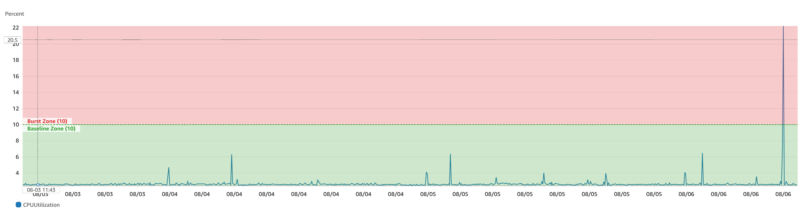
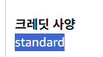
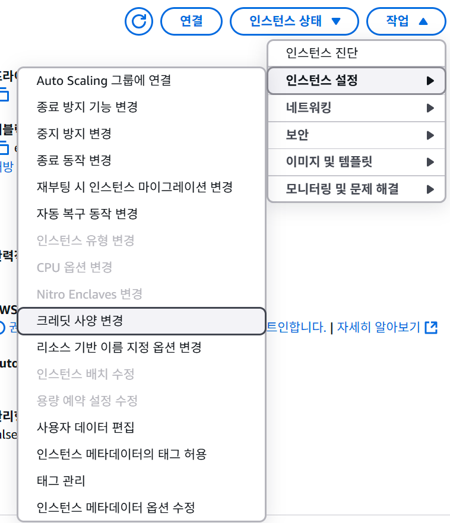

# AWS T2 인스턴스의 CPU 크레딧과 성능 관리

> [!TIP]
> AWS 의 T2 인스턴스는 **버스트 가능** 성능을 제공하는 인스턴스 유형입니다. 이는 평소에는 낮은 CPU 사용률을 유지하다가, 필요할 때 CPU 크레딧을 사용하여 일시적으로 성능을 끌어올릴 수 있는 구조를 의미합니다. 크레딧이 바닥나면 베이스 라인으로 쓰로틀 됩니다.

## EC2 CPU CloudWatch methric

[성능 버스트 가능 인스턴스에 대한 주요 개념 및 정의 - Amazon](https://docs.aws.amazon.com/ko_kr/AWSEC2/latest/UserGuide/burstable-credits-baseline-concepts.html)

AWS에서 EC2 서버를 대여하면 인스턴스 유형에 따라서 `CPU`, `Memory` 를 할당받아 사용할 수 있습니다. 대여한 인스턴스에 따라서 `CPU`의 `Baseline Utilization`이라는 것이 있습니다.

### 기준 사용률 (Baseline Utilization)

AWS 문서에 따르면, 기준 사용률은 인스턴스 유형에 따라 정해진 CPU 성능의 **기본 수준**입니다. **CPU 크레딧을 사용하지 않고도 낼 수 있는 최소한의 성능을 의미합니다.**

기준 사용률은 `획득하는 CPU 크레딧 수`가 `사용 중인 크레딧 수`와 일치 또는 미만일 때 크레딧을 사용하지 않고도 CPU를 사용할 수 있는 수준으로 이해하면 됩니다.

기준 사용률은 `vCPU` 사용률의 백분율로 표시되며 다음과 같이 계산됩니다.

> [!NOTE]
> (`Number of Credit earned` / `Number of vCPUs` / 60 min) = baseline utilization %

즉, 인스턴스 유형에 따라 달라지는 `시간 당 지급되는 크레딧의 개수`에 `CPU개수` 를 나눈 값에 1시간을 나눈 값이 인스턴스의 기준 사용률입니다.

| 인스턴스 유형 | 시간 당 지급되는 CPU 크레딧 | vCPU | vCPU 당 기준 사용률 |
| ------------- | --------------------------- | ---- | ------------------- |
| T2            |                             |      |                     |
| t2.nano       | 3                           | 1    | 5%                  |
| t2.micro      | 6                           | 1    | 10%                 |
| t2.samll      | 12                          | 1    | 20%                 |
| t2.medium     | 24                          | 2    | 20%                 |
| t2.large      | 36                          | 4    | 30%                 |

이외에도 관련 정보는 다음 AWS 사이트 참고해주세요.  
[성능 버스트 기능 인스턴스에 대한 주요 개념 및 정의](https://docs.aws.amazon.com/ko_kr/AWSEC2/latest/UserGuide/burstable-credits-baseline-concepts.html#earning-CPU-credits)

내가 사용하는 프리티어의 t2.micro를 계산해보면,
`(6 credit earned / 1 vCPUs) / 60 min = 10%` 라는 것을 알 수 있다.

이에 CloudWatch에 EC2 인스턴스의 CPU 사용률을 구분하였다.

## 10%를 기준으로 초록색 부분과 빨간색 부분의 의미

> [!IMPORTANT]
> Amazon EC2 인스턴스 유형은 고정된 CPU 리소스를 제공하는 반면, 성능 순간 확장 기능(버스트)을 제공합니다. 이렇게 하면 기준 CPU와 추가 버스트 CPU 사용량에 따른 비용만 지불하면 되므로 컴퓨팅 비용이 절감됩니다.

이게 무슨말이냐면 하나의 EC2 인스턴스를 대여하는데, CPU를 모두 사용할 수 있도록 하는 것이 아니라, 기준 사용량을 정해두고 이 이상을 초과하면 크레딧을 소모하고 사용한 만큼만 비용을 지불하도록 하여 전체 사용 비율을 줄이기 위해 만든 아키텍처입니다.

정리하면, AWS에서 대여한 EC2는 사용한 만큼 비용을 지불합니다. 그리고 CPU 크레딧에 의해서 비용이 추가되는 구조입니다. 크레딧은 무엇이고, 기본 사용률이 넘어가면 무조건 비용이 지불되는 것인지 중요합니다.

이는 결론적으로 아닙니다. 앞서 기준 사용률 이상을 사용하게 되면 크레딧이라는 것을 사용하여 버스트 합니다. 이 크레딧이라는 것은 인스턴스 유형별로 획득하는 시간 당 크레딧이 존재합니다. 인스턴스가 실행 중일 때 지속적으로 적립되는 크레딧입니다.

## CPU 크레딧의 개념

- 크레딧 획득 : 인스턴스는 실행되는 동안 꾸준히 CPU 크레딧을 획득합니다. 예를 들어 t2.micro 인스턴스는 1시간에 6개의 크레딧을 얻습니다.
- 크레딧 소모 : 기준 사용률 (Baseline Utilization)을 초과하여 CPU를 사용할 때 크레딧이 소모됩니다.
  - 1 크레딧은 1vCPU를 100%로 1분 동안 사용하는 양과 같습니다.
  - 무조건 크레딧은 `Baseline Utilization` 이하일 때 누적됩니다. 추가 요금을 내더라도
- 크레딧 누적 한도 : 획득한 크레딧은 무한정 쌓이지 않고, 인스턴스 유형에 따라 정해진 최대치까지만 누적됩니다. t2.micro의 경우 144개가 한도 입니다.

서버가 기준 사용량 이하로 운영되고 있다면 지속적으로 크레딧이 적립되는 버스트 할 수 있는 코인이라고 생각하면 됩니다. 하지만 이 크레딧이라는 것을 최대로 획득할 수 있는 개수와 시간 별 획득 크레딧은 인스턴스 유형 별로 다릅니다.

> [!TIP]
> t2.micro 의 경우 크레딧 누적 한도는 24(시간) \* 6 (시간 당 획득 크레딧) = 144 크레딧입니다.

한도에 도달한 후에는 새로 획득하는 크레딧은 이미지처럼 모두 삭제됩니다. 이렇게 획득한 크레딧을 이용해서 CPU를 기준 사용률 이상으로 버스트할 수 있습니다. 그리고 모든 크레딧을 사용하게 되면 인스턴스 유형에 따라서 비용이 추가되거나, 베이스 라인 이하로 스로틀 됩니다.

### 크레딧 예시

빨간색 그래프가 크레딧 사용량을 의미합니다. 1 크레딧은 1vCPU를 100%로 1분 간 사용한 양입니다. 이게 5분 단위로 수집 되기 때문에 최대 5개까지 소모를 할 수 있습니다.

일정 시간동안 크레딧을 최대로 (CPU 버스트) 사용하여 누적된 크레딧을 모두 소모하여 CPU가 스로틀 되는 과정입니다. 모든 크레딧을 소모한 이후에는 CPU가 기본 사용률 이상으로 버스트가 불가능해 모든 작업이 끝날 때까지 10% CPU만 사용하여 처리합니다. 이로인해 서버의 latency가 느려지고 처리량 저하가 발생합니다. 이로인해 타임아웃 오류나 장애로 이어질 수 있습니다.

우리 팀의 서버는 이처럼 장애가 발생하였고, 서버에서 응답이 되는 시간이 너무 오래걸리거나, 타임아웃으로 오류가 발생했었습니다.

이를 해결하기 위한 방법으로는

- 인스턴스 유형 스케일 업
- 크레딧 사양을 `stadard` -> `unlimited` 로 변경
- (메모리 부족일 경우 CPU가 직접 처리하며 사용률 증가일 경우) 메모리 증량, SWAP
  등이 있습니다.

### 인스턴스 모드 : Standard vs. Unlimited

CPU 크레딧을 모두 소진했을 때의 동작 방식에 따라서 두 가지 모드가 있습니다.

- **Standard 모드**
  - 획득한 크레딧을 모두 사용하면, CPU 성능이 기준 사용률 (Baseline Utilization, t2.micro = 10%)로 제한(throttle) 됩니다.
  - 추가 비용이 발생하지 않으며, AWS 프리 티어의 기본 모드입니다.
- **Unlimited 모드**
  - 크레딧을 모두 소진하더라도, 추가적인 성능이 필요하면 사용할 수 있습니다.
  - 사용된 만큼 추가 요금이 발생합니다. (시간 당 `0.05$`)

기본적으로 프리티어는 `standard` 모드로 사용한 만큼 비용을 지불하려면 `unlimited` 모드로 변경을 해주어야 합니다.

