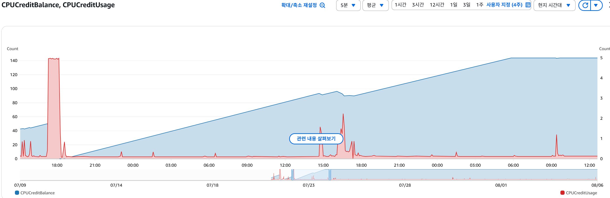

# 배포 후 서버에 생긴 문제점과 원인 해결방법

> [!NOTE]  
> [크레딧 등 CPU 관련 AWS 배경지식](./2025-08-06-cpu크레딧과-성능관리.md)

AWS의 인스턴스를 사용하면 서버 CPU가 스파이크 되거나 서버가 응답하지 않는 상태가 되는 문제가 발생할 수 있습니다. 내가 배포한 서버 역시 문제를 겪었습니다. 서버를 껏다 켜도 동일한 문제가 일어나는 일이 발생했습니다.

## 1. 문제 상황의 핵심 원인

CPU가 `99.9%` 사용률로 크레딧이 모두 소모되는 것이 가장 큰 문제의 원인이였습니다.

CPU 스파이크가 발생한 근본적인 원인은 무엇이고, 어느 서버 자원이 부족했는지, 다른 복합적인 원인이 있었는지가 문제 해결을 할 수 있는 Keypoint 라고 생각했습니다.

> [!IMPORTANT]
>
> - **메모리가 부족하면 왜 CPU 사용률이 올라갈까요?**
> - **메모리에 올라와있지 않지만 필요한 데이터를 디스크에서 읽으면 왜 CPU에 부담을 줄까요?**
> - **EBS와 네트워크 I/O 작업이 CPU에 어떤 영향을 미치나요?**
> - **스프링 부트 애플리케이션의 특성 상 CPU 스파이크 사이에 어떤 연관성이 있을까요?**

---

### 원인

서버의 (`AWS EC2 Instance`) 메모리 부족 시 CPU 스파이크 현상은 가상 메모리를 사용하면서 발생합니다. 메모리가 부족하면 운영체제는 하드 디스크의 일부 공간을 메모리처럼 사용합니다. 이 과정에서 빈번한 디스크 접근이 발생하고, 이로 인해 CPU 사용률이 급증하여 스파이크 현상이 나타납니다.

> [!TIP]
>
> ### 가상 메모리 (Virtual Memory)
>
> 컴퓨터 시스템에서 물리적인 메모리(RAM)의 용량보다 더 큰 프로그램을 실행할 수 있도록 하는 기술입니다. 즉, 하드 디스크의 일부 공간을 마치 RAM처럼 사용하는 방법입니다.
>
> - **메모리 확장** : 가상 메모리는 물리적 메모리 용량의 한계를 극복하고, 더 큰 프로그램을 실행할 수 있게 해줍니다.
> - **주소 변환** : CPU가 가상 주소로 메모리에 접근하려 할 때, 메모리 관리 장치(`MMU`)가 이 가상 주소를 실제 물리 주소로 변환하여 RAM에 매핑합니다.
> - **페이지 파일** : 하드 디스크에서 생성하는 가상 메모리 파일을 사용하여 데이터를 저장하고 관리합니다.
> - **디스크 페이징** : 메모리가 부족할 때, 사용하지 않는 페이지를 디스크로 옮기고, 필요할 때 다시 불러오는 디스크 페이지(스왑) 기법을 사용합니다.

- **가상 메모리 :**

  - 메모리가 부족하면 운영체제는 하드 디스크의 일부를 메모리처럼 활용하는 가상 메모리 기법을 사용합니다. 이때 **메모리에 로드되지 않은 데이터나 프로그램은 하드 디스크에 임시로 저장됩니다.**

- **디스크 접근 증가 :**

  - 가상 메모리를 사용하면 프로개름이나 데이터가 필요할 때마다 하드 디스크에서 데이터를 읽고 써야 합니다. **잦은 디스크 접근은 CPU에 큰 부담을 주어 CPU 사용률을 급증시키는 원인이 됩니다.**

- **스파이크 현상 :**

  - 디스크 접근과 CPU 사용률 증가는 상관 관계를 가져 메모리 부족이 심할수록 스파이크 빈도와 강도가 높아집니다.

- **시스템 성능 저하** :
  - CPU 스파이크는 시스템 전반의 성능 저하를 유발합니다. CPU 10% 이하로 스로틀 된 후에는 프로그램 실행 속도가 느려지거나, 시스템이 멈추는 현상이 발생할 수 있습니다.

메모리가 부족하면 CPU가 올라가는 문제는 다음과 같습니다.

메모리가 부족하면 운영체제는 가상 메모리를 사용하여 하드 디스크에 당장 사용하지 않는 데이터나 프로그램을 임시로 저장합니다. 그리고 프로그램이나 데이터가 필요할 때마다 하드 디스크에 접근해서 데이터를 읽고
써야 합니다. 이런 디스크 직접 접근이 CPU 사용률을 증가시키고 부담을 주기 때문에 CPU 사용률이 스파이크 됩니다.

`CPU`가 스파이크된 시간 대의 디스크 IO 작업 메트릭을 보면 최대 `19G` 까지 늘어난 것을 확인할 수 있었습니다.
게다가 EC2 인스턴스 내에 있는 디스크를 사용한 것이 아니라, 연결되어 있는 `EBS` 스토리지를 사용하기 때문에 네트워크 I/O 작업도 일어나면서
CPU 버스트가 크게 발생할 수 밖에 없던 것을 확인할 수 있었습니다.

> [!IMPORTANT]
> ### CPU가 디스크에 직접 접근하는 데 부담을 느끼는 이유
>
> 1. 디스크 접근 속도가 CPU와 메모리에 비해 매우 느리기 때문입니다.
> 2. CPU가 직접 디스크에 접근하는 것은 복잡한 과정을 필요로 하며, 이로 인해 시스템 전체의 효율성이 저하될 수 있기 떄문입니다.
>
> - **속도 차이** :
>   - CPU, 메모리는 매우 빠른 속도로 데이터를 주고 받을 수 있지만, 디스크 (`HDD`, `SDD`)는 물리적인 동작을 필요로 하기 때문에 상대적으로 속도가 느립니다. CPU가 직접 디스크에 접근하여 데이터를 읽고 쓰려면, 디스크 회전이나 데이터 탐색 등에 많은 시간이 소요되어 전체적인 시스템 속도가 느려집니다.
> - **CPU 부담 증가 :**
>   - CPU는 단순한 데이터 이동 뿐만 아니라 다양한 연산을 수행해야 합니다. 만약 CPU가 디스크 접근까지 직접 처리한다면, 연산 작업에 집중해야 할 CPU가 데이터 이동에 많은 시간을 할애하게 되어 전체적인 작업 효율이 떨어집니다.
> - **복잡한 제어 :**
>   - 디스크 접근은 단순한 데이터 I/O 이상의 복잡한 과정을 필요로 합니다. 예를 들어, 디스크 헤더 이동, 데이터 블록 찾기, 오류 검사 등의 과정을 거쳐야 합니다.
>     결론적으로, CPU가 디스크에 직접 접근하는 데 부담을 느끼는 이유는 속도 차이와 복잡한 제어 과정 때문입니다.

### 스프링 부트 애플리케이션과 CPU 스파이크 사이의 연관성

`Java` 기반 `Spring Boot`는 시작 시점에 `JVM` 의 `DataArea` 에 운영체제로 부터 메모리를 할당받아서 사용하는 특징이 있습니다. 애플리케이션의 규모나 동시 요청 수에 따라 메모리 사용률이 변동하게 되는데,
이 변동 폭이 `T2.micro` 인스턴스의 작은 메모리 용량(`1GiB`)을 초과할 경우 문제가 발생합니다.

## 해결 방법

AWS 인스턴스의 할당된 메모리의 크기를 `swap` 메모리 증설을 이용해서 Disk I/O 감소가 문제 해결의 방법이었습니다.  
[AWS 메모리 사용량 문제 해결 방법](https://repost.aws/ko/knowledge-center/ec2-linux-high-memory-usage)

`AWS` 에서도 메모리 크기 문제를 해결할 수 있도록 swap memory 설정하는 방법을 공유하고 있습니다. 하지만 swap 메모리를 설정하여 사용하는 것이 근본적인 문제 해결 방법이 아니라고 생각했습니다.
왜냐하면 `swap` 메모리를 설정하는 것도 결국에는 디스크 (AWS EC2 인스턴스 내, EBS ❌) 에 읽고 쓰는 것이기 때문입니다.

그렇기 때문에 스왑 메모리를 최대한 덜 쓰도록 설정했고, 기존에 50% 이상 사용하던 스왑 메모리를 최대한 서버 메모리를 사용하도록 해서 20% 내로 유지하도록 했습니다.

> [!IMPORTANT]
> ### 스왑 메모리는 어떻게 해결책이 될까?
>
> 스왑 메모리를 설정하는 것은 근본적으로 디스크에 데이터를 쓰고 읽는 행위입니다. 하지만, `T2.micro` 인스턴스의 경우, 이 작업이 `EBS` 에 직접 접근하는 것보다 더 효율적입니다.
>
> - 성능 차이 :
>   - EC2 인스턴스의 로컬 스토리지에 스왑 파일을 생성하는 방식은, 네트워크를 통해 연결된 DBS 스토리지에 접근하는 것보다 자원 사용이 적습니다.
> - 크레딧 소모 완화 :
>   - `EBS I/O` 작업은 CPU 크레딧을 소모하는 주된 원인 중 하나입니다. 잦은 EBS 접근이 CPU 사용률을 높여 크레딧을 빠르게 고갈시킵니다. 스왑 메모리를 사용하여 서버가 버스트 상태로 진입하는 것을 늦추거나 방지하여 장기적인 성능 저하를 막는데 도움을 줍니다.
>     결론적으로, 스왑 메모리를 디스크에 쓴다는 점은 동일하지만, 접근 방식(로컬 VS. 네트워크) 의 차이가 성능에 영향을 미치고, 이는 결국 크레딧 소모를 줄여 `T2.micro` 인스턴스의 안정적인 운영에 기여합니다.

스왑 메모리를 사용하여 당장의 문제를 해결했지만,임시 방편에 가깝습니다. 더 많은 트래픽을 처리하고 안정성을 부여하려면 스케일 아웃 또는 캐싱 전략을 도입하는 것이 장기적인 해결책입니다.

## 문제 해결의 결과

기존에 메모리 부족으로 인해 CPU 사용률이 늘어나는 이유에 대해서 잘 몰랐는데, 디스크에 메모리를 대신해서 쓰고 읽으면서 CPU에 부하를 주는 문제가 발생하는 사실을 알았습니다.
그리고 크레딧이라는 개념에 대해서도 알게되었습니다.

저사양 인스턴스에서 스프링 부트는 무겁고, 메모리를 많이 차지해 애플리케이션 시작으로도 많은 메모리를 차지합니다. 그래서 메모리를 최대한 덜 쓰도록 노력해야하고 모니터링을 통해서 가상메모리를 사용하거나 디스크 I/O를 유의해서 살펴봐야합니다. 이후에는 모니터링에 알림 기능을 통해서 재빠른 문제 분석과 해결을 통해 안정적인 서버 운영을 해야겠다고 생각했습니다.

> [!NOTE]
> ### 문제 해결의 결과
>
> - **CPU 사용률 감소** : 메모리 부족 시 발생하던 잦은 디스크 I/O 작업이 줄어들면서, CPU에 가해지던 부하 감소
> - **응답 시간 개선(인스턴스 메모리 주로 사용 설정)** : 불필요한 스왑 작업이 줄어들어 안정적ㅣ고, 느려지는 문제가 해결되었습니다.
> - **CPU 크레딧 소모 완화** : EBS I/O 작업이 줄어들면서 크레딧 소모량 감소. 덕분에 인스턴스가 버스트 상태에 머무는 시간이 적어지고, 스로틀로 인해 생기는 문제를 방지했습니다.

## 향후 개선 방안

- **스케일 업(Scale-Up) 또는 스케일 아웃(Scale-out)**
  - 현재의 최적화 작업은 임시 방편입니다. 트래직이 더 늘어나거나 안정적인 성능이 요구될 경우, 메모리가 더 큰 인스턴스로 스케일 업 하거나, 여러 대의 인스턴스를 두고 트래픽을 분산하는 스케일 아웃 고려
- **스트레스 테스트 및 성능 최적화**
  - 향후 부하 테스트를 통해 애플리케이션의 한계를 파악하고, 필요하다면 캐싱 도입, 내부적인 성능 최적화 등 작업을 통해 최적화
