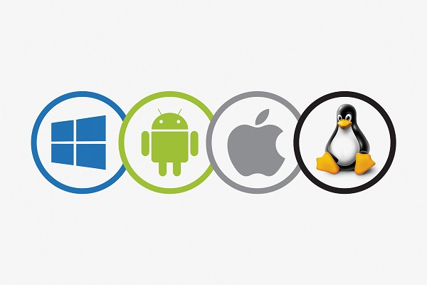

# 운영체제 개요

> [!NOTE]
> 운영체제는 응용 프로그램의 잘못된 동작으로 컴퓨터가 망가지는 것을 막기 위해 컴퓨터 전체를 관리하고 운영하는 소프트웨어이다.

운영 체제 = **컴퓨터 자원을 효율적으로 관리하는 소프트웨어**

운영체제는 컴퓨터의 CPU, 메모리, 디스크, 입출력 장치 등 컴퓨터의 자원을 관리하고, 하드웨어를 편리하고 효율적으로 사용할 수 있도록 돕는 소프트웨어입니다.

어떻게 운영체제가 이러한 기능을 할 수 있는가는 컴퓨터 시스템의 구조를 살펴보면 알 수 있습니다.

## 운영체제의 구성

운영체제는 커널과 인터페이스로 구성되어 있습니다. 내가 만드는 애플리케이션은 운영체제의 커널의 `System call` 을 이용하여 하드웨어를 이용하여 작동하게 됩니다.

운영체제의 구성 요소로 `Kernel`은 프로세스 관리, 메모리 관리, 저장장치 관리와 같은 핵심 기능을 구현한 프로그램입니다.

- 여러 응용 프로그램을 실행합니다.
  - 프로그램이 실행되면 프로세스가 됩니다.
  - 프로세스에 CPU를 배분하고 작업 환경을 만들어 주는 것이 주요 역할입니다.
- 메모리 관리 : 프로세스를 메모리에 배치합니다.
- 파일 시스템 관리
- 입출력 관리 : 주변 장치로부터 발생하는 입출력을 관리
- 프로세스 간 통신 관리

운영체제의 커널의 역할은 작업을 하기 위해서 자원을 할당하고 수거하는 자원을 관리합니다. 자원을 응용 프로그램에 나누어 주어 사용자가 작업을 할 수 있도록 돕습니다. 또한, 사용자가 직접 자원을 접근하는 것을 막아 컴퓨터 자원을 보호하고 효율적으로 관리해주는 컴퓨터의 핵심입니다.

### 커널의 시스템 호출과 드라이버

커널은 사용자가 직접 자원에 접근하지 못하도록 막는 대신에 `System call` 을 통해서 컴퓨터 자원을 이용할 수 있도록 합니다.

- `System call` 은 커널이 제공하는 시스템 자원을 사용하기 위한 함수입니다.
- 응용 프로그램이 하드웨어 자원에 접근하거나 운영체제가 제공하는 서비스를 이용하려면 `System call`을 사용해야 합니다.
- 운영체제는 커널이 제공하는 서비스를 호출로 제한하고 다른 방법으로는 커널에 들어오지 못하게 막아 컴퓨터 자원을 보호합니다.
- 시스템 호출은 커널이 제공하는 서비스를 이용하기 위한 인터페이스이며 사용자가 자발적으로 커널 영역에 진입할 수 있는 유일한 수단입니다.

드라이버는 커널과 하드웨어를 연결하는 인터페이스입니다. `System call` 은 커널 앞부분 전체를 감싸고 있습니다. 이는 `System call`을 거치지 않으면 커널에 진입할 수 없다는 의미입니다. 반면, 드라이버는 전체를 감싸지 않습니다.

이는 커널이 제공하는 드라이버도 있고 하드웨어 제작자가 제공하는 드라이버도 있기 때문입니다.

## 정리

**운영체제의 가장 핵심은 `Kernel` 이라고 생각합니다.** 커널은 컴퓨터 자원을 관리하여 효율적으로 프로그램이 동작하도록 하며, 제공되는 인터페이스와 `System call`을 이용해서 사용자가 직접 컴퓨터 자원 접근을 막고 보호하고 관리합니다.

1. **운영체제의 정의**  
   컴퓨터 자원을 효율적으로 관리하는 소프트웨어를 운영체제 혹은 OS라고 부른다.  
   프로세스에 컴퓨터 자원을 골고루 배분하여 작업 환경을 만들어 준다.

2. **운영체제의 역할과 목표**

- 자원 관리
- 자원 보호
- 하드웨어 인터페이스 제공
- 사용자 인터페이스 제공

3. **운영체제의 구성**  
   운영체제의 핵심 기능을 모아놓은 것을 커널이라고 한다.  
   커널에 명령을 내리고 그 결과를 알려주는 것을 사용자 인터페이스라고 한다.  
   커널과 하드웨어의 인터페이스는 드라이버라고 한다.
