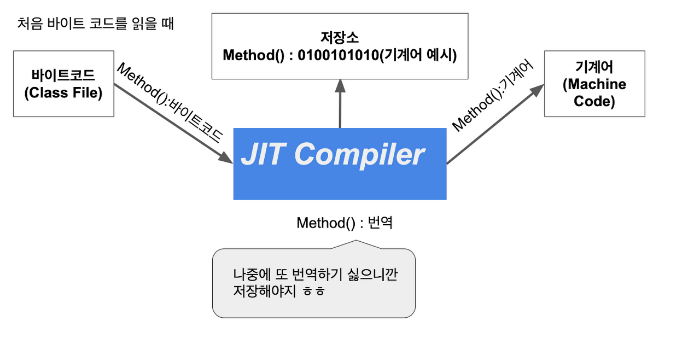
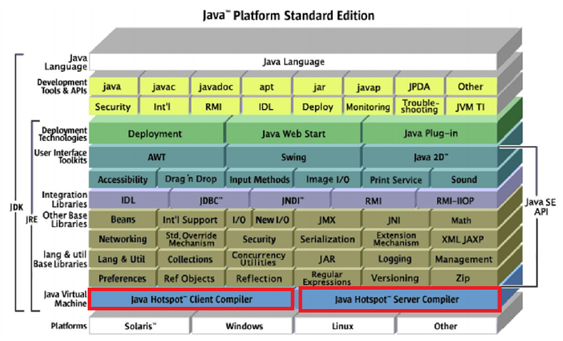

# 1장 자바의 역사와 JVM

자바 언어를 만들면서 “**Write Once, Run Anywhere**” (WORA) 라는 모토가 만들어졌으며, 여러 플랫폼에서 수행할 수 있는 개발 언어를 목표로 개발되었습니다.

## 자바는 인터프리트 언어이다.

자바는 한 번의 컴파일을 통해 바이트 코드를 생성하고 JIT 를 통해 어떤 장비에서도 수행할 수 있도록 해줍니다. 따라서 기존에 사용하던 무거운 컴파일 (C 언어는 컴파일 시점에 모두 컴퓨터가 알아먹을 수 있도록 컴파일한다.) 보다 빠른 환경을 구축할 수 있다.

## JIT 컴파일러

JIT를 사용하는 언어에는 자바와 .NET 등이 있다. JIT (Just-In-Time) 으로 동적 변환이라고 보면 됩니다. 이러한 JIT 라는 것을 만든 이유는 프로그램 실행을 보다 빠르게 하기 위해서이다. (컴파일할 때 컴퓨터가 알아들을 수 있는 어셈블리어로 하지 않고, 바이트 코드로 컴파일하기 때문에 보다 실행이 빠르다.)명칭이 컴파일러지만 실행 시점에 적용되는 기술이다.

- **인터프리터 방식** : 프로그램을 실행할 때마다 컴퓨터가 알아 들을 수 있는 언어로 변환하는 작업을 수행.
- **정적 컴파일 방식** : 실행하기 전에 컴퓨터가 알아 들을 수 있는 언어로 변환하는 작업을 미리 실행

JIT 는 이 두가지 방식을 혼합한 것이다. 변환 작업은 인터프리터에 의해서 지속적으로 지속적으로 수행되지만, 필요한 코드의 정보는 캐시에 담아두었다가 재사용한다.

**왜 인터프리터 언어인가.**

`javac` 를 통해서 컴파일 하였는데 그럼 그냥 정적 컴파일 방식이 아닌가?

이 부분은 자바가 동작하는 방식에서 알 수 있다.

`javac` 명령어를 통해 컴파일을 하는 단계에서 만들어진 .class 파일은 바이트 코드이다. 어느 환경에서든 실행할 수 있다. `javac` 라는 명령어를 수행한다는 것은 텍스트로 만든 java 파일을 어떤 OS 에서도 수행할 수 있도록 바이트 코드라는 파일로 만든 것 뿐이다. 컴퓨터가 알아 들을 수 있도록 하려면 다시 변환 작업이 필요하다. 이 변환 작업을 JIT 컴파일러에서 한다.

> **자바 소스코드 → 자바 컴파일러 → 컴파일된 byte 코드 → JVM → 기계 코드 → 하드웨어 OS**

<aside>

JIT 를 사용하면 반복적으로 수행되는 코드는 매우 빠른 성능을 보인다는 장점이 있지만, 반대로 처음에 실행할 때에는 변환 단계를 거쳐야 하므로 성능이 느리다는 단점이 있다. 하지만 최근들어 CPU 성능이 많이 좋아졌고, JDK의 성능 개선도 많이 이루어졌기 때문에 단점이 많이 개선되었다.

</aside>

## Java Hotspot {Client/Server} Compiler

JDK 1.3 부터 자바에서는 Hotspot JVM Complier 제공한다.

- Java Virtual Machine
  - Hotspot Client Compiler
  - Hotspot Server Compiler

**CPU 코어가 하나뿐인 사용자**를 위해서 만들어진 것이 `Hotspot Client Comiler` 이다. 이 컴파일러의 주요 특징은 애플리케이션 시작 시간을 빠르게 하고, 적은 메모리를 점유하도록 하는 것이다.

CPU 코어가 많은 장비에서 애플리케이션을 돌리기 위해서 만들어진 것이 `Hotspot Server Compiler` 이다. 이 컴파일러는 애플리케이션 수행 속도에 초점이 맞추어져 있다.

<aside>

JDK1.3 에서는 두 개의 컴파일러를 나눈 이유

JDK1.3 은 2000년에 발표했다. 과거에는 PC에서 많은 CPU 코어를 사용할 수 없었다. 요즘에는 노트북, 스마트 폰도 듀얼 코어가 대세이고, 데스크 탑은 쿼드 코어도 사용한다. 또한 서버를 사요할 때 CPU 코어가 하나 뿐인 사용자를 위해서 두 개의 컴파일러가 나뉘어졌다.

</aside>

- 내 EC2 서버의 자바는?
  
  Server VM 을 사용하고 있다.

## JVM이 바이트 코드를 기계어로 번역 실행

1. **클래스 로더**
   - 역할 : `.class` 파일을 읽어서 JVM의 메모리 영역으로 로드하는 역할을 한다.
   - 단계 : 로딩, 링크, 초기화의 세 단계를 거쳐서 클래스를 준비한다.
2. **런타임 데이터 영역**
   - 역할 : JVM이 프로그램을 실행하면서 사용하는 데이터를 저장하는 메모리 영역이다.
     - 프로그램 실행에 필요한 코드, 데이터, 객체, 변수 등을 보관한다.
   - 요소
     - **메서드 영역**
     - **힙 영역**
     - **스택 영역**
     - **PC 레지스터**
     - **네이티브 메서드 스택**
3. **실행 엔진**
   - 역할 : 런타임 데이터 영역에 로드된 바이트 코드를 실제로 실행하는 역할을 한다.
   - 구성 요소
     - **인터프리터** : 바이트 코드를 한 줄씩 읽어 기계어로 변환하고 실행한다.
     - **JIT 컴파일러** : 인터프리터의 비효율성을 개선하기 위해 도입됨. 자주 사용하는 코드를 네이티브 코드로 컴파일하여 캐싱해두어 실행 성능을 향상한다.
     - **GC 가바지 컬렉터** : 힙 영역에서 더 이상 참조되지 않는 객체를 찾아 자동으로 메모리에서 해제하는 역할을 한다. 개발자가 직접 메모리를 관리할 필요가 없다.

## Heap Area의 Young 영역(Eden, Survivor) 과 Old 영역으로 나뉘는 이유

> **힙 영역의 분할 (Young/Old)**
> Young, Old 로 나누는 이유는 **객체의 수명 주기 특성을 활용하여 가비지 컬렉션을 더욱 효율적으로 수행하기 위함이다.**

- **Weak Generation Hypothesis (약한 세대 가설)**
  1. 대부분의 객체는 빠르게 소멸한다. (short-livend)
  2. 오래 살아남은 객체일수록 앞으로도 계속 살아남을 가능성이 높다.

이 가설에 기반하여 Heap 을 두 영역으로 나누어, 각 영역의 특성에 맞는 GC 전략을 적용한다.

1. **Young 영역**
   - 목적 : 새로 생성된 객체들의 빠른 소멸을 효율적으로 처리한다. 대부분의 객체가 Young 영역에 생성되었다가 소멸되므로, 전체 힙을 탐색하는 오버헤드를 줄일 수 있다.
2. **Old 영역**
   - Old 영역이 꽉 차면 `Major GC` 가 발생한다. 이 GC는 Old 영역을 비우기 위한 것이며, **때로는 Young 영역까지 포함하여 전체 힙을 탐색한다.**
   - 목적 : 오래 살아남을 가능성이 높은 객체들을 관리하며, Young 영역보다 적은 빈도로 GC가 발생하도록 하여 애플리케이션 성능 저하 최소화

**Young GC가 Old GC 보다 빠른 이유**

- 영역의 크기 : Young 영역은 Old 영역에 비해 크기가 훨씬 작다. 따라서 GC가 탐색하고 이동시켜야 할 객체의 수가 적다.
- 객체의 특징 : Young 영역은 대부분의 객체가 금방 소멸하는 특성을 가진다. 즉 GC가 발생했을 때 살아남아 이동 시켜야 할 객체보다 소멸 시켜야 할 객체가 많다. 이는 `Copying Collection` 방식에 효율적이다. 살아 남은 객체만 복사하면 된다.
- **GC 알고리즘 차이**
  - **Young GC (`Minor GC`**) : 주로 **Copying Collection** 방식을 사용한다. 살아있는 객체만을 복사하고 나머지 영역은 통째로 비우는 방식이라 효율적이다.
  - **Old GC (`Major/Full GC`)** : `Mark-Sweep-Compact` 방식이 사용된다. 이는 전체 Old 영역을 탐색하여 살아있는 객체를 표시하고 (Mark), 죽은 객체를 제거한 후(Sweep) , 메모리 단편화를 제거하기 위해 객체들을 한 곳으로 모으는 (Compact) 과정을 거친다. 이 과정은 Major GC 보다 훨씬 복잡하고 많은 시간을 소요한다.

## 자바 개발자로서 JVM과 가비지 컬렉션의 동작 방식을 이해하는 것이 왜 중요한가

<aside>

내가 생각했을 때는 개발을 진행할 때는 많은 상관이 없을 것이라고 생각한다. 요즘 개인 PC의 성능이 매우 좋기 때문이다. 하지만 서버에 배포하고 운영하는 데는 실제 운영 서버 사양에 따라서 비용이 증가하고 비용 증가 폭이 크기 때문에 적절한 설정을 통해 최대한의 효율에 맞게 서버를 운영하는 것이 좋지 않을까 생각한다.

</aside>
