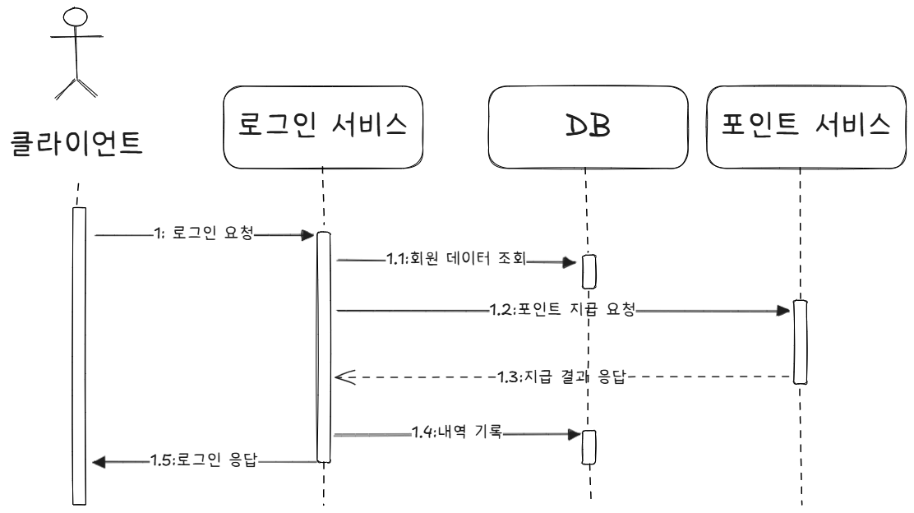
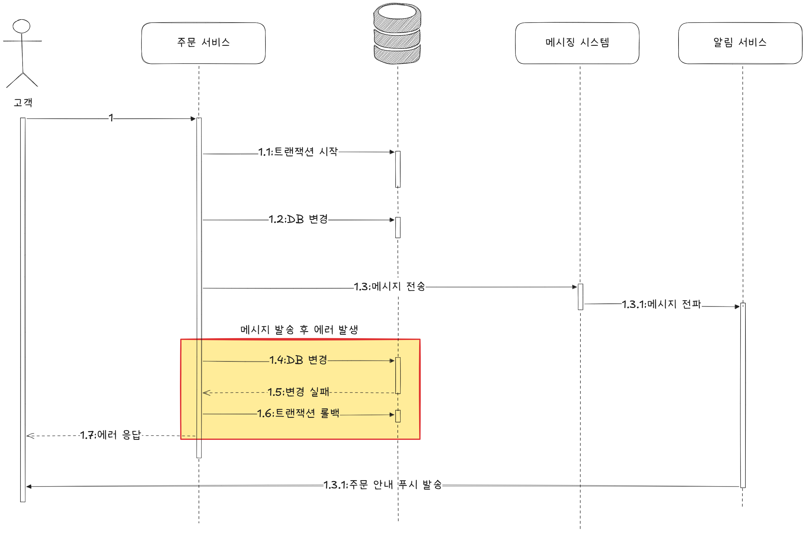
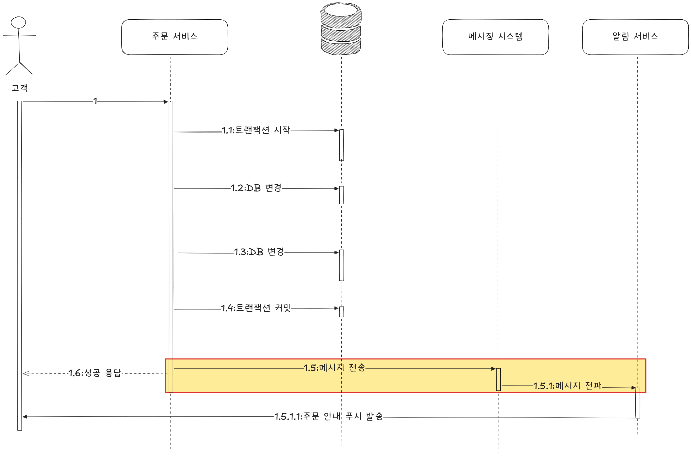
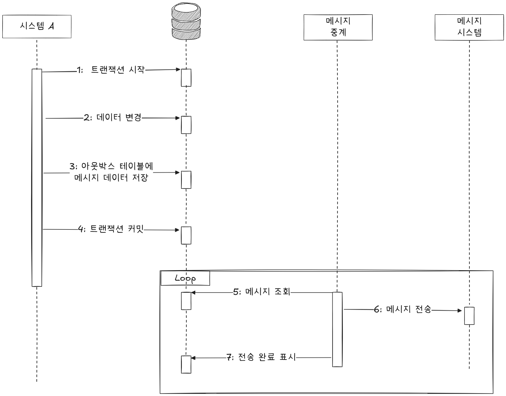
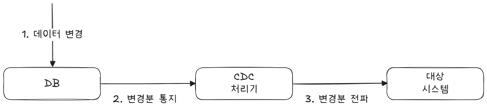

# 5장 비동기 연동

## 동기 연동, 비동기 연동

동기 방식 (synchronous) : **순차적으로 실행, 한 작업이 끝날 때까지 다음 작업이 진행되지 않습니다.**

- 장점 : 프로그램의 흐름을 직관적으로 이해할 수 있습니다.

<div align="center">
  
</div>

> [!NOTE]
> 사용자를 찾고, 암호를 비교하고, 포인트를 지급하고, 로그인 내역을 추가하는 순서로 실행됩니다.  
> 포인트를 지급하기 전에 로기은 내역을 추가하는 일은 없습니다.  
> 중간에 부가 작업으로 인해서 로그인이 실패합니다.

### 동기 방식으로 외부 연동 시 고려할 점 (포인트 서비스)

- _외부 연동의 실패가 전체 기능의 실패인가?_
- _연동 서비스의 응답 시간_
- _외부 연동이 트랜잭션 안에서 동작할 때, 외부 연동 실패가 전체 기능의 실패인가 확인해야 합니다._

> 앞선 예에서 포인트 지급 서비스 연동에 실패하면 로그인도 실패합니다.
> 만약 포인트 서비스에 장애가 발생하면 그 시간 동안 로그인도 못해서 전체 기능을 사용할 수 없게 됩니다.

❌ 로그인 자체는 정상적으로 동작해야 하고, 나머지 기능을 사용할 수 있어야 합니다.

이를 위해서 다음과 같이 코드를 짤 수 있습니다.

```java
public boolean login(String id, String password) {
  Optional<User> opt = findUser(id);
  if (opt.isEmpty()) {
    return false;
  }
  User u = opt.get();
  if (!u.matchPassword(password)) {
    return false;
  }
  PointResult result = pointClient.giveLoginPoint(id);
  if (result.isFailed()) {  // 지급에 실패했을 경우 기록 후 다음 작업을 실행합니다.
    recordPointFailure(id, result);
  }
  appendLoginHistory(id);
  return true;
}
```

> 중간 단계에서 실패 여부를 확인한 뒤 기록합니다. 이 과정은 비동기 방식이 아닌 동기적으로 동작하지만, 외부 서비스 오류로 인해 로그인에 실패하는 경우 이를 적절히 처리할 수 있도록 합니다.

- _연동하는 외부 서비스의 응답 시간을 고려해야 합니다._
  > 연동 서비스의 응답 시간이 길어질수록 전체 응답 시간이 느려지게 됩니다.  
  > **심한 경우 외부 연동 서비스로 인해 전체 서비스가 먹통이 되기도 합니다.**

비동기(Asynchronous) 방식이란

한 작업이 끝날 때까지 **기다리지 않고 바로 다음 작업을 처리**하는 것을 말합니다. 예를 들어 포인트 서비스의 외부 연동이 끝날 때까지 기다리지 않고 바로 다음 작업을 진행합니다.

<br>

즉, 비동기를 적용하는 것의 **가장 핵심적인 부분**은

외부 서비스의 서버 장애나 과도한 트래픽으로 인해 응답 불가, 지연, 타임아웃 등이 발생하고, 이로 인해 **전체 서비스로 장애가 전파되는 것을 막기 위함**입니다.

<div align="center">
  
</div>

> [!NOTE]
> 별도의 스레드를 이용하여 포인트 지급 연동을 비동기로 처리하는 과정입니다.    
> 이를 통해, 포인트 서비스에 일시적으로 문제가 생겨 포인트 지급 처리에 지연이 생겨도 로그인 서비스의 응답 시간은 증가하지 않습니다.

<br>

비동기 방식으로 연동해도 크게 문제가 되지 않는 경우
1. 쇼핑몰에서 주문이 들어오면 판매자에게 PUSH 보내기 (PUSH 서비스 연동)
    - 연동에 약간의 시차가 발생해도 문제가 되지 않는다. 쇼핑몰에서는 1분 뒤에 판매자에게 PUSH가 나가도 판매에는 지장이 없기 때문이다.
2.  학습을 완료하면 학생에게 포인트 지급 (포인트 서비스 연동)
    - 재시도를 통해서 데이터 정합성을 맞출 수 있다. 학습 완료 후 포인트 지급에 실패했을 때, 다시 시도하면 포인트 지급에 문제가 되지 않는다.
3. 컨텐츠를 등록할 때 검색 서비스에도 등록 (검색 서비스 연동)
    - 수동으로 처리할 수 있다면 문제가 되지 않는다. 컨텍츠가 노출되지 않을 경우에 수동으로 검색 서비스에 연동할 수 있다.
4. 인증 번호를 요청하면 SMS로 인증 메시지 발송 (SMS 발송 서비스 연동)
    - 무시되어도 되는 기능이 있다. 주문 알림 푸시 같은 경우이다. 판매자에게 푸시가 발송되지 않더라도 판매에는 문제가 생기지 않는다. 단지 주문 확인이 늦어질 뿐이다.

비동기 연동은 다양한 방식으로 구현할 수 있습니다.
1. 별도 스레드로 실행
2. 메시징 시스템 이용
3. 트랜잭션 아웃박스 패턴 사용
4. 배치로 연동
5. CDC 패턴 이용


## 별도 스레드로 실행하기
비동기 연동을 하는 가장 쉬운 방법은 별도 스레드로 실행하는 것입니다. 예를 들어, 푸시 서비스를 비동기로 연동하고 싶다면 새로운 스레드를 생성하여 연동하는 코드를 실행할 수 있습니다.

1. 스레드 풀
```java
ExecutorService executor = Executors.newFixedThreadPool(50);
...
public OrderResult placeOrder(OrderRequest req) {
  executor.submit(() -> pushClient.sendPush(pushData));

  return result;
}
```

2. Spring Async
```java
public class PushService {
  
  @Async
  public void sendPushAsync(PushData pushData) {
    pushClient.sendPush(pushData);
    ...
  }
}
```

> [!NOTE]
> `@Async` 애노테이션을 사용할 때는 **메서드 이름에 비동기 실행과 관련된 단어를 추가하는 것이 좋습니다.**   
> 왜냐하면, 다른 스레드에서 실행되기 때문에 호출하는 곳에서 `try-catch` 예외 코드 블록이 실행되지 않기 때문입니다. 

**스레드와 메모리**

스레드는 자체적으로 일정 크기의 메모리를 사용합니다. 순간적으로 수십만 개의 비동기 작업을 위해 스레드를 생성할 경우

- 수십만 개의 스레드를 생성하기 위한 시간이 오래 걸립니다.
- 스레드 스케줄링을 위해 많은 CPU 시간을 사용해서 실행 시간이 느려집니다.

스레드 풀을 이용해 스레드를 일정한 개수로 유지하고 자바의 가상 스레드를 사용하는 방법이 있습니다.

가상 스레드는 OS 스레드가 아닌 런타임에서 관리하는 경량 스레드로 적은 메모리를 사용합니다.

## 메시징
서로 다른 시스템 간에 비동기로 연동할 때 주로 사용하는 방식은 메시징 시스템을 사용하는 것입니다.

<div align="center">
  
</div>

> [!NOTE]
> **시스템 A**는 전달할 데이터를 메시지로 생성해 메시징 시스템에 보냅니다.   
> **메시징 시스템**은 이 메시지를 **시스템 B**로 전달하며, **시스템 B**는 수신한 메시지의 데이터를 활용해 필요한 작업을 수행합니다.

시스템 간 직접 호출하는 것과 비교하면 구조가 더 복잡해졌지만, 구조가 복잡해지는 대신 다른 이점을 얻을 수 있습니다.

1. 두 시스템이 서로 영향을 주지 않습니다.
> 직접 연동했을 경우에 시스템 B의 성능저하가 발생할 경우, 그 성능 저하는 다시 시스템 A에까지 영향알 미칩니다.

  - 시스템 A에서 발생한 트래픽 급증이 시스템 B의 임계치를 초과하여 성능 저하가 전파되는 것을 차단할 수 있습니다.
  - 시스템 B는 A가 저장한 메시지를 성능에 맞게 처리할 수 있습니다.

> [!NOTE]
> 시스템 B는 성능에 맞게 메시징 시스템에서 처리 가능한 만큼만 처리합니다.
> 즉, 메시징 시스템은 중간에서 메시지를 보관하는 버퍼 역할을 합니다.

2. 확장에 용이합니다.
> 시스템 A가 시스템 C로도 데이터를 전송해야 할 때, 시스템 C와 메시징 시스템을 연결하기만 하면 되므로 구조 확장이 간단하고 유연합니다.

- A 시스템이 B에만 메시지 전송하던 것을 C에도 메시지 전송할 때
<div align="center">
  
</div>

> [!NOTE]
> 생산자/소비자, 게시자/구독자 개념 알아두기
>
> 메시징 시스템에서 사용하는 용어입니다.
>
> - 메시지를 생성해서 메시징 시스템으로 보내는 측을 **생산자** 또는 **게시자**
> - 메시징 시스템으로부터 메시지를 받아 처리하는 측을 **소비자** 또는 **구독자**

메시징 시스템 용도로 많이 사용되는 기술은 *카프카, 래빗MQ, 레디스 pub/sub* 등이 있습니다.

### 카프카 특징
- 높은 처리량, 초당 백 만 개 이상의 메시지를 처리 가능
- 수평확장 용이. 서버(브로커), **파티션**, 소비자를 늘리면 된다.
- **메시지를 파일로 보관**해서 메시지가 유실되지 않는다.
- 소비자는 메시지를 언제든지 재처리할 수 있다.
- **풀(Pull) 모델 사용**. 소비자가 카프카 브로커에서 메시지를 읽어 가는 방식이다.

### RabbitMQ 특징
- 클러스터를 통해 처리량을 높일 수 있다. 단, 카프카보다 더 많은 자원을 필요로 한다.
- 메모리에만 메시지를 보관하는 큐 설정을 사용하면 장애 상황 시 메시지가 유실될 수 있다.
- 메시지는 큐에 등록된 **순서대로 소비자에게 전송**된다.
- 메시지가 소비자에게 전달됐는지 확인하는 기능을 제공한다
- **푸시 모델을 사용한다.** 래빗MQ 브로커가 소비자에게 메시지를 전송한다. 소비자의 성능이 느려지면 큐에 과부하가 걸려 전반적으로 성능 저하가 발생할 수 있다.
- 다재 다능하다. **AMQP, STOMP** 등 여러 프로토콜을 지원하고, 게시/구독 패턴뿐만 아니라 요청/응답, 점대점 패턴을 지원한다. 또한 우선순위를 지정해서 처리 순서를 변경할 수도 있다.

### 레디스 pub/sub 특징
- 메모리를 사용하므로 지연 시간이 짧고, 래빗MQ 대비 처리량이 높다.
- 구독자가 없으면 메시지가 유실된다.
- 기본적으로 영구 메시지를 지원하지 않는다.
- 모델이 단순해서 사용하기 쉽다.

## 메시지 생성 측 고려 사항
메시지를 생성할 때 가장 중요한 고려 사항은 **메시지 유실**입니다.

특히 `time out` 문제로 인해 메시징 시스템에 요청이 정상적으로 전달되지 않을 수 있으므로, 이에 대한 오류 처리가 필요합니다.

오류 처리 방법은 다음 세 가지로 구분할 수 있습니다.
1. 무시
  - 오류를 별도로 처리하지 않고 단순히 무시합니다.
2. 재시도
  - 동일한 메시지를 다시 전송합니다.
  - 이 과정에서 중복 메시지가 발생할 수 있으므로, 메시지마다 고유 식별자(ID)를 부여하여 소비자가 중복 여부를 판단할 수 있도록 합니다.
3. 실패 로그 기록
  - DB나 파일에 실패 정보를 저장합니다.
  - 이후 별도의 후처리 과정을 통해 재처리하거나 보정합니다.

메시지를 생성할 때 또 하나 중요한 고려 사항은 **DB 트랜잭션과의 연동**입니다.   
DB 트랜잭션이 실패하여 롤백되었음에도 메시지가 발송된다면, 잘못된 데이터가 외부로 전달되는 문제가 발생할 수 있습니다.

이를 방지하기 위해서는 트랜잭션이 정상적으로 완료된 이후에 메시지를 전송해야 합니다.


<div align="center">
  
</div>

> 메시지를 전송한 뒤 **DB 트랜잭션이 롤백**되면 잘못된 메시지가 전송될 수 있습니다.

> [!NOTE]
> 예를 들어, 주문 서비스에서 DB 연동이 실패해 트랜잭션이 롤백 되었음에도 불구하고, 메시지가 롤백 이전 단계 (1,3 단계)에서 메시징 시스템으로 전송될 수 있습니다.
> 
> 이 경우 사용자는 주문 실패 화면을 보면서도, 동시에 `주문 성공` 알림 푸시를 받는 모순된 상황이 발생합니다.

따라서 이러한 문제를 방지하기 위해서는 **트랜잭션이 완료된 이후에 메시지를 전송**해야 합니다.

이렇게 하면 메시지가 항상 실제 상태와 일치하는, 유효한 데이터만 포함하게 됩니다.

<div align="center">
  
</div>

> 트랜잭션이 완료 (커밋/롤백) 된 뒤에 메시지를 전송합니다.

정리하면, 메시지를 생성 측에서 고려해야 할 사항은 다음과 같습니다.

1. **메시지 유실에 대한 오류 처리**
2. **DB 트랜잭션 범위 밖에서 메시지 생성**

이 두가지를 지키면 메시징 시스템이 안정적으로 동작하고, 항상 일관된 데이터를 전달할 수 있습니다.

> [!NOTE]
> **추가로 알아두면 좋은 부분**
>
> DB 처리와 메시지 연동을 묶지 말자.   
> DB에 데이터를 반영한 뒤에 메시지를 최대한 유실 없이 보내고 싶다면 트랜잭션 아웃박스 패턴을 검토합니다.

## 메시지 소비 측 고려 사항
메시지 소비자는 다음 2가지 이유로 **동일 메시지를 중복해서 처리**할 수 있습니다.

1. 메시지 생산자가 같은 데이터를 가진 메시지를 두 번 전송
  - 메시지에 **고유한 ID**를 부여해서 이미 처리했는지 여부 추적
2. 소비자가 메시지를 처리하는 과정에서 오류가 발생해서 메시지 재수신
  - 소비자가 메시지를 처리하는 과정에서 `read time out` 발생 (외부 API 호출, 실제로는 성공)
  - 중복 처리를 막기 위해 멱등성을 갖도록 API를 구현합니다.

중복 메시지 처리와 함께, 메시지 소비자를 구현할 때 또 하나 고려 사항은 **소비자가 메시지를 정상적으로 처리하고 있는지 모니터링**하는 것입니다.

> 만약 소비자의 처리 속도가 느려지면 큐에 메시지가 계속 쌓이게 되고, 결국 큐가 가득 차서 생산자가 새로운 메시지를 넣지 못하는 상황이 발생할 수 있습니다.

## 메시지 종류 : 이벤트와 커맨드
메시지에는 크게 2가지 종류가 존재합니다.
- 이벤트
- 커맨드

> [!NOTE]
> 이벤트는 어떤 일이 발생했음을 알리는 메시지입니다. 즉, 특정 행위가 실행되었다는 사실 자체를 의미합니다.

<div align="center">
  
</div>

> 이벤트 메시지는 정해진 수신자가 없습니다. 발생한 사건에 관심이 있는 소비자가 메시지를 수신하는 방식입니다. 그렇기 때문에 소비자 확장에 적합합니다.

> [!NOTE]
> 커맨드는 특정 동작을 요청하는 메시지입니다.   
> 메시지를 수신한 소비자는 그 요청에 따라 기능을 실행합니다.

<div align="center">
  
</div>

> 커맨드 메시지는 정해진 수신자의 기능 실행에 초점이 맞춰져 있으며, 지정한 수신자가 아니면 메시지를 받아도 의미 있는 동작을 수행할 수 없습니다.

## 트랜잭션 아웃박스 패턴
메시지를 생성할 때는 잘못된 메시지가 발송되지 않도록 DB 트랜잭션이 완료된 이후에 메시지를 전송하는 것이 바람직합니다. 하지만 이 방식만으로는 완벽하지 않습니다.

메시지를 전송하는 코드에 재시도 로직이나 예외 처리를 넣더라도, 메시징 시스템과의 연동 과정에서 여전히 실패가 발생할 수 있기 때문입니다.

<div align="center">
  
</div>

> [!NOTE]
> 메시지 데이터가 유실되지 않도록 보장하기 위해서는 먼저 메시지를 DB에 안전하게 저장하는 것이 중요합니다. 이후 별도의 프로세스가 이 데이터를 읽어 메시징 시스템으로 전달합니다.

> 트랜잭션 아웃박스 패턴은 하나의 DB 트랜잭션 안에서 다음 두 가지 작업을 함께 처리합니다.   
1. 실제 업무 로직에 필요한 DB 변경 작업을 수행합니다.
2. 메시지 데이터를 아웃박스 테이블에 추가합니다.

## 배치 전송
배치 전송은 비동기 데이터 연동 방식 중 가장 전통적인 방법입니다.   
메시징 시스템이 데이터를 거의 실시간으로 전달하는 것과 달리, 배치는 일정한 주기마다 데이터를 모아 한꺼번에 전송합니다.

예를 들어,
- 결제 승인 데이터를 모아 다음 날 일괄 전송하거나,
- 택배 발송 요청 데이터를 1시간 간격으로 모아 전달하는 방식이 이에 해당합니다.

> 전형적인 배치 실행 과정
> 1. DB에서 전송할 데이터를 조회한다.
> 2. 조회한 결과를 파일로 기록한다.
> 3. 파일을 연동 시스템에 전송한다.

**파일 형식**   
- `값(구분자)값2(구분자)값3` (CSV 등 구분자 기반 형식)
- `이름1=값1 이름2=값2 이름3=값3` (Key-Value 형식)
- **JSON 문자열**

**추가로 정의해야 할 항목**   
파일 형식 외에도 다음 요소들을 미리 협의해야 합니다.
- **송·수신 주체** : 누가 파일을 전송하고 누가 수신할지
- **시간** : 언제, 어떤 주기로 전송할지
- **경로** : 어떤 위치(폴더/스토리지)를 통해 전달할지

> [!NOTE]
> **전송 주체 결정**
>
> 전송의 주체는 사전에 합의가 필요합니다. 특별한 규칙이 정해져 있지는 않으며, **상황에 따라 조율**됩니다.
> - **생산자 업로드 방식** : 생산자가 직접 파일을 업로드하려면 소비자 시스템을 외부에 노출해야 합니다.
> - **소비자 다운로드 방식** : 보안상 더 안전하며 일반적으로 선호되는 방식입니다.

파일 전송 대신 API를 통해 데이터를 일괄 전송할 수도 있습니다.   
이 방식은 전송 데이터 크기가 작거나 처리해야 할 항목이 많지 않을 때 주로 사용됩니다.

### 재처리 기능 만들기

파일 전송은 항상 정상적으로 이루어지는 것은 아닙니다.

예를 들어,

- 파일 생성 과정에서 오류가 발생하거나
- 네트워크 상태가 불안정해 전송이 실패할 수 있습니다.

이런 상황을 대비해 **전송 실패 시 일정 시간 후 자동으로 재전송하는 기능**을 구현해두면, 수작업으로 재처리하는 번거러움을 크게 줄일 수 있습니다.

하지만 재시도에도 불구하고 실패하는 경우도 있습니다. 이를 대비해 **관리자가 직접 재처리를 실행할 수 있는 수단**을 마련해두는 것이 좋습니다.

- 예 : CLI 명령어나 전용 API 제공

이렇게 하면 문제가 발생했을 때 **빠르고 편리하게 배치를 재실행**할 수 있습니다.

> **파일이 없는 게 정상일까?**
>
>배치가 정상적으로 실행되었더라도, 전송할 데이터가 없는 경우에는 파일이 생성되지 않도록 구현된 시스템이 있을 수 있습니다.
> 
> 하지만 **고객사 입장에서는 파일이 없는 이유를 알 수 없습니다.**
> 
> - 정말 전송할 데이터가 없어서 파일이 없는건지
> - 오류가 발생해 파일 생성에 실패한 것인지 구분할 수 없기 때문입니다.
> 
> 따라서 **데이터가 없는 경우에도 빈 파일을 생성하여 전송**하는 것이 바람직합니다.

## CDC (Change Data Capture)
CDC는 변경된 데이터를 추적하고 판별해서 변경된 데이터로 작업을 수행할 수 있도록 하는 소프트웨어 설계 패턴입니다.

<div align="center">
  
</div>

INSERT, UPDATE, DELETE 쿼리가 실행되면 DB의 데이터가 변경됩니다.

DB는 이러한 변경 내용을 CDC 처리기에 전달합니다.

CDC 처리기는 전달받은 데이터를 확인하고 가공한 뒤, 대상 시스템에 전파합니다.   
변경 데이터를 전파하는 방식은 크게 두 가지 형태로 나눌 수 있습니다.
1. **변경 데이터를 그대로 대상 시스템에 전파**
    - 변경 데이터를 그대로 전파하는 방식은 두 시스템에 1:1 관계일 때 적합합니다.
2. **변경 데이터를 가공/변환해서 대상 시스템에 전파**
    - 모든 변경 데이터를 전송할 필요가 없는 경우에는 데이터를 가공 변환하여 전파할 수 있습니다.