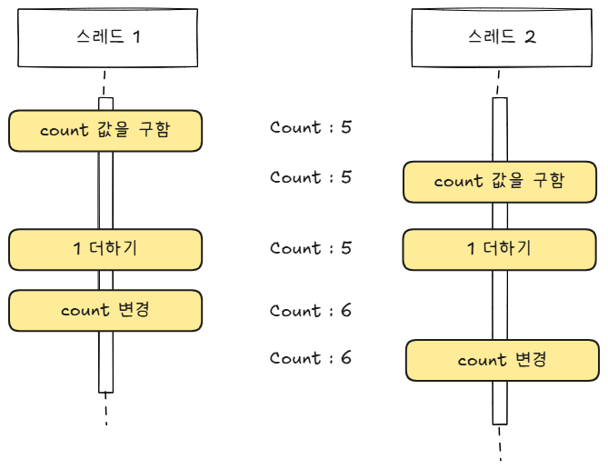
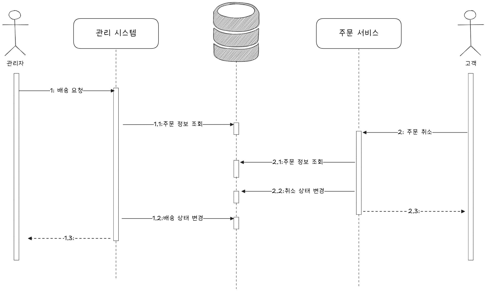

# 동시성 1

### 이 장에서 다룰 문제

- <U>동시성 문제
- 잠금을 이용한 동시 접근 제어
- 잠금을 이용한 동시 접근 제어
- 원자적 타입과 동시성 지원 컬렉션
- DB와 동시성 : 선점 잠금과 비선점 잠금
- 잠금 주의 사항</U>

<br>

## 서버와 동시 실행

트래픽이 적은 서비스라도 초당 100건 이상의 요청이 들어올 수 있습니다.  
클라이언트에 빠른 응답을 제공하기 위해 서버는 동시에 여러 요청을 병렬로 처리합니다.

<div align="center">
  
</div>

> [!NOTE]
> 서버는 동시에 여러 클라이언트의 요청을 처리하며 DB도 동시에 여러 쿼리를 실행합니다.

서버가 여러 클라이언트 요청을 동시에 처리하는 방식은 크게 두 가지로 나눌 수 있습니다.

1. 스레드 기반 처리 : 요청마다 별도의 스레드를 할당하여 처리합니다.
2. 비동기 I/O 기반 처리 : 스레드를 추가로 만들지 않고, Non-Blocking I/O를 활용해 여러 요청을 처리합니다.

<br>

---

<br>

### 기존 Spring MVC (Blocking I/O)

- 톰캣 같은 서블릿 컨테이너 사용
- 요청 1개 -> 스레드 1개 할당
- 스레드는 요청 처리 중 DB 조회/외부 API 호출 같은 I/O 작업에서 블로킹
- 블로킹 동안 해당 스레드는 놀고 있지만(대기), 다른 요청을 처리하지 못함
- 요청이 많아지면 스레드 수를 계속 늘려야 하고 이게 한계에 부딪히면 서버 리소스가 바닥남

<br>

### WebFlux (Non-Blocking, Event Loop)

WebFlux는 Netty 같은 이벤트 루프 서버 위에서 동작합니다.

**동작 흐름**

1. **요청 수신**  
   하나의 이벤트 루프(스레드)가 요청을 받고, 이를 Reactor의 Publisher/Subscriber 모델로 흘려보냅니다.
2. **작업 등록**
   - 요청이 DB 조회 같은 I/O 작업을 만나면, 스레드가 블로킹하지 않고 작업이 완료되면 알려줘라고 이벤트를 등록만 합니다.
   - 이때 다른 스레드는 다른 요청을 처리하러 곧바로 돌아갑니다.
3. **응답 완료 알림 (Callback/Event)**
   - I/O 작업이 끝나면 이벤트 루프가 콜백 이벤트를 받아 후속 작업을 이어서 실행합니다.
   - 즉, 한정된 스레드로도 동시에 수많은 요청을 비동기적으로 처리할 수 있게 됩니다.

<br>

---

<br>

### 동시 실행과 주의점

서버는 어떤 방식을 사용하더라도 기본적으로 여러 작업을 동시에 실행합니다.  
이 과정에서 서로 다른 스레드가 동시에 같은 데이터를 조회하거나 수정할 수 있습니다.  
만약 동시 실행을 고려하지 않고 코드를 작성하면, 쉽게 드러나지 않는 복잡한 버그가 발생할 수 있습니다.

<div align="center">
  
</div>

> **경쟁 상태 (Race Condition)**
>
> 여러 스레드가 동시에 **공유 자원**에 접근할 때, **접근 순서에 따라 실행 결과가 달라지는 상황**을 경쟁 상태(Race Condition) 라고 합니다.
>
> 즉, 어떤 스레드가 먼저 자원을 읽거나 썼는지에 따라 예측할 수 없는 결과가 발생할 수 있습니다.

<br>

## 잘못된 데이터 공유로 인한 문제 예시

```java
public class PayService {
  private Long payId;  // 공유 자원

  public payResp pay(PayRequest req) {
    // payId 생성
    // 결제 로직 실행
    // 응답 결과를 받아 Id와 함께 데이터 업데이트
  }
}
```

다중 스레드 환경에서 `PayService` 싱글톤 객체를 동시에 사용하면, 인스턴스 변수가 공유됩니다.  
그 결과, 스레드 간 간섭으로 인해 간헐적으로 잘못된 데이터가 저장되는 경쟁 상태가 발생할 수 있습니다.

<br>

### DB도 동시성 문제가 존재합니다.

<div align="center">
  
</div>

> 관리자와 고객이 동시에 주문 정보를 변경하면 충돌이 발생할 수 있습니다.  
> 예를 들어,
>
> - **관리자**는 주문 상태를 `배송중`으로 변경하려 하고,
> - **고객**은 동시에 같은 주문을 `취소`로 변경하려 할 수 있습니다.
>
> 이 경우 처리 순서나 타이밍에 따라 최종 주문 상태가 달라지며, 시스템에 **일관성 문제**가 생길 수 있습니다.

<br>

## 프로세스 수준에서의 동시 접근 제어

앞서 살펴본 동시성 문제는 **프로세스 수준**과 **데이터베이스 수준** 모두에서 고려해야 합니다.

<br>

### 잠금(Lock)을 이용한 접근 제어

프로세스 수준에서 동시에 데이터를 수정하지 못하도록 막는 대표적인 방법은 **잠금(Lock)** 입니다.  
잠금을 사용하면 공유 자원에 접근할 수 있는 스레드를 한 번에 하나로 제한할 수 있습니다.

<br>

**동작 절차**

1. 잠금을 획득함
2. 공유 자원에 접근 (임계 영역)
3. 잠금을 해제함

<br>

> [!NOTE]
>
> ### 임계 영역(Critical Section)
>
> 임계 영역은 **둘 이상의 스레드나 프로세스가 동시에 접근하면 안되는 공유 자원을 다루는 코드 영역**을 말합니다.  
> 일반적으로, **락을 획득한 시점부터 반납하기 전까지의 구간**이 임계 영역에 해당합니다.

<br>

> [!NOTE]
>
> ### 뮤텍스 (Mutex)
>
> 뮤텍스는 Nutual Exclusion의 줄임말로, 흔히 잠금 (Lock) 이라고도 부릅니다.  
> 프로그래밍 언어마다 용어가 다를 수 있습니다. 예를 들어
>
> - Java에서는 `Lock` 타입을 사용하고
> - Go에서는 `Mutex` 타입을 사용합니다.

<br>

## 동시 접근 제어를 위한 구성 요소

자바의 `ReentrantLock` 은 한 번에 하나의 스레드만 잠금을 획득할 수 있습니다.  
즉, 동시에 하나의 스레드만 공유 자원에 접근할 수 있습니다.

<br>

잠금(Lock) 외에도 동시 접근을 제어하기 위한 주요 구성 요소로는 **세마 포어** (**Semaphore**)와 **읽기-쓰기 잠금** (**Read-Write Lock**)이 있습니다.

<br>

### 세마 포어

세마 포어는 **동시에 실행할 수 있는 스레드의 개수를 제한**하는 방식입니다.  
→ 벌크 헤드 패턴에 사용(Resilience4j 의 벌크 헤드도 내부적으로 세마 포어를 사용해서 구현되어 있음)

자원 접근을 일정 수준으로 제한하고 싶을 때 사용합니다.

예를 들어, 외부 서비스에 대한 동시 요청을 최대 5개로 제한하고 싶을 때 세마 포어를 적용할 수 있습니다.

> 세마 포어는 허용 가능한 숫자를 이용해서 생성합니다.  
> 이 숫자를 자바 세마포어 구현체는 **퍼밋**(**permit**)이라고 표현하며, Go는 **weight**라고 표현합니다.

```java
public class MyClient {
  private Semaphore semaphore = new Semaphore(5);

  public String getData() {
    try {
      semaphore.acquire(); // 퍼밋 획득 시도
    } catch (InterruptedException e) {
      throw new RuntimeException(e);
    }

    try {
      String data = ... //외부 연동 코드
      return data;
    } finally {
      semaphore.release();  // 퍼밋 반환
    }
  }
}
```

> [!NOTE]
> **동작 순서**
>
> 1. 세마 포어에서 퍼밋 획득
> 2. 코드 실행
> 3. 세마 포어에 퍼밋 반환
>
> 세마 포어에서 퍼밋을 구하고 반환하는 연산을 각각 P연산 (또는 wait 연산), V연산(또는 signal연산) 이라고 합니다.

<br>

### 읽기-쓰기 잠금 (Read-Write Lock)

일반적인 잠금은 읽기와 쓰기 모두 동일한 잠금을 사용하기 때문에, **읽기 작업만 있을 때도 한 번에 하나의 스레드만 접근**할 수 있습니다.

> 이 문제를 해결하기 위해 사용하는 방식이 읽기-쓰기 잠금입니다.

<br>

**특징**

- 쓰기 잠금 : 한 번에 한 스레드만 획득 가능
- 읽기 잠금 : 여러 스레드가 동시에 획득 가능
- 쓰기 중에는 읽기 불가 : 쓰기 잠금이 해제될 때까지 읽기 잠금을 얻을 수 없음
- 읽기 중에는 쓰기 불가 : 모든 읽기 잠금이 해제될 때까지 쓰기 잠금을 얻을 수 없음

> 동시에 여러 스레드가 읽기를 실행할 수 있습니다.  
> 단, 쓰기와 읽기는 동시에 수행할 수 없습니다.  
> 따라서 **읽기-쓰기 잠금**을 사용하면 단순 잠금에서 발생하는 **읽기 성능 저하 문제를 완화**할 수 있습니다.

```java
public class UserSessionRW {
  private ReadWriteLock lock = new ReentrantReadWriteLock();
  private Lock writeLock = lock.writeLock();
  private Lock readLock = lock.readLock();
  private Map<String, UserSession> sessions = new HashMap<>();

  public void addUserSession(UserSession session) {
    writeLock.lock();
    try {
      sessions.put(session.getSessionId(), session);
    } finally {
      writeLock.unlock();
    }
  }

  public UserSession getUserSession(String sessionId) {
    readLock.lock();
    try {
      return sessions.get(sessionId);
    } finally {
      readLock.unlock();
    }
  }
}
```

> [!NOTE]
> **기아 상태**
>
> 특정 스레드나 프로세스가 **자원을 오랫동안 할당받지 못해 실행되지 못하는 상태**를 말합니다.
>
> **읽기-쓰기 잠금(ReadWriteLock) 과의 연관**
>
> 읽기-쓰기 잠금에서도 기아 현상이 발생할 수 있습니다.
>
> - 원인 : 읽기 쓰레드가 계속 들어와 락을 점유 -> 쓰기 스레드가 락을 획득하지 못함.
> - 쓰기 락이 자원을 기다리지만, 계속 읽기 락이 들어와서 기아 상태에 빠짐
>
> 이를 방지하기 위해 `ReentrantReadWriteLock(true)` 공정 모드 옵션을 제공합니다.

<br>

### 원자적 타입 (Atomic Type)

멀티 스레드 환경에서 **여러 스레드가 동시에 같은 데이터를 수정**하면 예상치 못한 결과가 발생할 수 있습니다.  
이를 **동시성 문제**(**Concurrency Issue**) 라고 합니다.

<br>

1. **잠금을 사용한 동시성 제어**

```java
public class Increaser {
  private Lock lock = new ReentrantLock();
  private int count = 0;

  public void inc() {
    lock.lock();
    try {
      count++;  // 임계 영역
    } finally {
      lock.unlock();
    }
  }
}
```

- `Lock`을 이용해 한 번에 하나의 스레드만 `count` 값을 변경하도록 보장합니다.
- 하지만 **다른 스레드들은 잠금을 기다리며 CPU를 사용하지 못하므로 비효율적**입니다.
- 즉, **안정성은 확보되지만 성능이 떨어지는 단점**이 있습니다.

<br>

2. **잠금 없이 동시성 제어 : 원자적 타입 (Atomic Type)**   
   잠금 대신 `java.util.concurrent.atomic` 패키지의 원자적 타입을 사용할 수 있습니다.

- `AtomicInteger`
- `AtomicLong`
- `AtomicBoolean`

<br>

이 객체들은 내부적으로 **CAS(Compare-And-Swap) 연산**을 사용해 스레드를 멈추지 않고도 안전하게 데이터를 갱신합니다.

```java
public class Increaser {
  private AtomicInteger count = new AtomicInteger(0);

  public void inc() {
    count.increaseAndGet();
  }

  public int getCount() {
    return count.get();
  }
}
```

- CAS는 다음 순서로 작동합니다.
  1. 현재 값이 예상(expected) 값과 같은지 비교합니다.
  2. 같다면 새로운 값으로 교체합니다.
  3. 다르다면 아무것도 하지 않고 재시도합니다.

`AtomicInteger` 클래스의 내부 구현은 잠금을 사용하는 것보다 복잡하지만, 사용하는 입장에서는 `Lock`을 사용하는 것보다 간단하게 동시성 문제를 해결할 수 있습니다.

<br>

> [!NOTE] 
> `AtomicInteger` 는 간단한 카운터 연산처럼 짧은 코드에서 동시성을 보장할 때 이상적입니다.  
> 복잡한 임계 구역에서는 여전히 `Lock`이 필요할 수 있습니다.

<br>

### 동시성 지원 컬렉션 (Concurrent Collections)

멀티 스레드 환경에서 스레드에 안전하지 않은 컬렉션을 공유하면 데이터가 깨지는 동시성 문제가 발생할 수 있습니다.

예를 들어, `HashMap`이나 `HashSet`을 여러 스레드가 동시에 수정하면 내부 구조가 손상되어 예외가 발생하거나 데이터가 유실될 수 있습니다.

<br>

1. **동기화된 컬렉션 (Synchronized Collections)**   
   이 문제를 해결하는 방법 중 하나는 컬렉션 전체에 잠금을 적용하는 것입니다.  
   즉, 모든 접근과 수정 연산이 `synchronized` 블록으로 보호되어 한 번에 한 스레드만 접근할 수 있도록 하는 방식입니다.

자바의 `Collections` 클래스는 기존 컬렉션을 손쉽게 동기화 된 버전으로 감싸는 메서드를 제공합니다.

```java
Map<String, String> map = new HashMap<>();
// 동기화된 컬렉션 객체 반환
Map<String, String> syncMap = Collections.synchronizedMap(map);
```

> 모든 연산이 잠금으로 보호되므로 안전하지만,  
> 여러 스레드가 동시에 접근하면 **경쟁 대기 시간으로 인해 성능이 저하**될 수 있습니다.

2. **동시성 컬렉션 (Concurrent Collections)**   
   동시성 문제를 해결하는 또 다른 방법은 **동시성 자체를 지원하는 컬렉션 타입을 사용**하는 것입니다.

```java
ConcurrentMap<String, String> map = new ConcurrentHashMap<>();
map.put("key1", "value1")
// 동시성 지원 컬렉션은 잠금 범위를 최소화합니다.
```

`ConcurrentMap` 은 데이터를 변경할 때 **잠금 범위를 최소화(세분화)** 하여 여러 스레드가 서로 다른 버킷의 데이터를 동시에 수정할 수 있습니다.

따라서 키의 해시 분포가 균등하고 동시 수정이 많을 수록, `Collections.synchronizedMap()` 보다 훨씬 높은 성능을 보입니다.

<br>

3. **불변 (Immutable) 컬렉션의 활용**   
   동시성 문제를 근본적으로 피하는 또 다른 방법은 불변 객체를 사용하는 것입니다.

즉, 기존 데이터를 수정하지 않고 **매번 새로운 객체를 생성하는 방법**입니다.

대표적인 예로 `CopyOnWriteArrayList`가 있습니다.

```java
List<String> list = new CopyOnWriteArrayList<>();
list.add("a");
// 내부적으로 새로운 배열을 복사 후 추가
```

<br>

- Write 연산 시 기존 배열을 복사해 새로운 배열을 생성합니다.
- Read 연산은 잠금을 사용하지 않아 매우 빠릅니다.
- 따라서 읽기 비중이 높고 쓰기가 적은 환경에서 적합합니다.

<br>

| 구분          | 대표 클래스                                     | 특징                     | 적합한 상황                            |
| ------------- | ----------------------------------------------- | ------------------------ | -------------------------------------- |
| 동기화 컬렉션 | `Collections.synchronizedMap()`                 | 전체 잠금 (synchronized) | 스레드 수가 적고 단순한 동기화 필요 시 |
| 동시성 컬렉션 | `ConcurrenyHashMap`, `ConcurrenyLinkedQueue` 등 | 세분화된 잠금 (CAS 기반) | 고성능 멀티스레드 환경                 |
| 불변 컬렉션   | `CopyOnWriteArrayList`                          | 불변 데이터 생성 방식    | 읽기 위주 환경                         |
