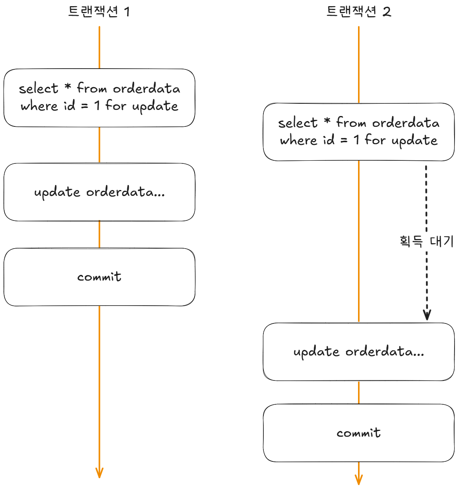
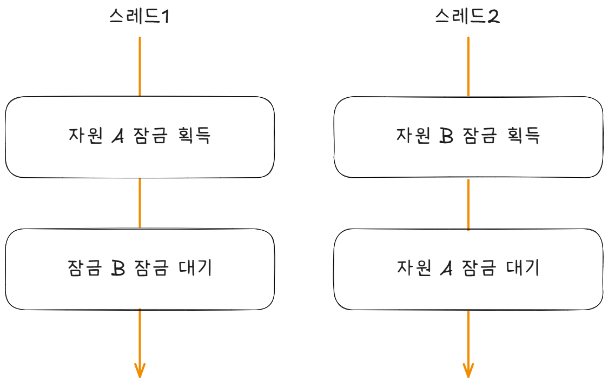
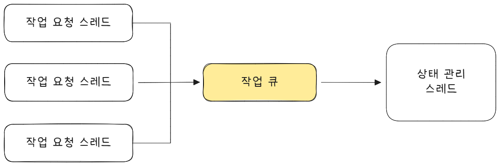

# 동시성 2

## DB와 동시성

데이터베이스는 트랜잭션을 통해 여러 연산을 하나의 논리적 단위로 묶어 처리합니다.

트랜잭션 내의 작업은 모두 성공하면 커밋되고, 하나라도 실패하면 롤백되어 데이터의 일관성을 보장합니다.

하지만 트랜잭션만으로 모든 **동시성 문제를 해결할 수는 없습니다.**  
여러 사용자가 동시에 데이터를 수정할 때는 여전히 충돌이 발생할 수 있으므로, 이 경우에는 **DB의 잠금**(**Lock**) 기능을 활용해 데이터를 보호해야 합니다.

<br>

대부분의 DB는 명시적인 잠금 기능을 제공합니다.  
이 중 **선점 잠금**(**비관적 잠금**)은 동일한 레코드에 대해 한 번에 하나의 트랜잭션만 접근하도록 제어합니다.

반면, **비선점 잠금**(**낙관적 잠금**)은 쿼리 실행을 막지 않으며 값을 비교해 충돌을 감지해 데이터의 일관성을 유지합니다.

> [!NOTE] > **비관적 잠금과 낙관적 잠금**
>
> 비관적(Pessimitic) 잠금과 낙관적(Optimitic) 잠금은 동시성 문제를 해결하는 두 가지 접근 방식입니다.
>
> 이 용어에는 **실패 가능성에 대한 관점**이 담겨 있습니다.
>
> - **비관적 잠금**은 "충돌이 자주 발생할 것"이라 비관적으로 가정합니다.  
>   따라서 한 번에 하나의 트랜잭션만 접근하도록 배타적 잠금을 사용해 충돌을 미리 방지합니다.
>
> - **낙관적 잠금**은 "충돌이 드물 것"이라 낙관적으로 가정합니다.  
>   잠금을 걸지 않고, 대신 값을 비교해 변경 충돌을 감지하는 방식으로 동시성 문제를 해결합니다.
>
> 즉, 비관적 잠금은 미리 잠그는 방식이고,  
> 낙관적 잠금은 나중에 검증하는 방식입니다.

<br>

### 선점 (비관적 잠금)

선점 잠금은 **먼저 접근한 트랜개션이 데이터를 잠그는 방식**입니다.

잠금을 획득하기 위한 SQL 문은 다음과 같습니다.

```sql
SELECT *
  FROM 테이블
 WHERE 조건
FOR UPDATE
```

이 쿼리는 조건에 해당하는 레코드를 조회하는 동시에 잠금을 설정합니다.

한 트랜잭션이 레코드를 잠그면, **잠금이 해제될 때까지 다른 트랜잭션은 해당 레코드에 접근할 수 없습니다.**

잠금은 트랜잭션이 종료될 때 (커밋 또는 롤백 시) 자동으로 해제됩니다.

<div align="center">
  
</div>

> 트랜잭션 1이 먼저 데이터를 잠그면,  
> 트랜잭션 2는 트랜잭션 1이 종료되어 잠금을 해체할 때까지 대기합니다.  
> 트랜잭션 1이 커밋된 후 트랜잭션 2가 잠금을 획득하면,  
> 이미 변경된 최신 데이터를 조회하게 됩니다.

<br>

> [!NOTE] > **분산 잠금 (Distributed Lock)**
>
> 분산 잠금은 **여러 프로세스가 동시에 동일한 자원에 접근하지 못하도록 제어하는 방식**입니다.
>
> 기본적인 개념은 일반 잠금과 같지만, **여러 프로세스나 서버 간에 잠금을 관리한다는 점이 다릅니다.**  
> 간단한 분산 잠금은 DB의 선점 잠금을 활용해 구현할 수 있습니다.
>
> 대부분의 시스템이 이미 DB를 사용하므로, **추가 인프라 없이 손쉽게 구성할 수 있다는 장점이 있습니다.**  
> 반면 **트래픽이 많거나 확장성이 필요한 경우,**  
> **Redis 기반의 분산 잠금**을 사용하는 것이 더 효율적입니다.
>
> Redis는 속도가 빠르고, 검증된 분산 **잠금 라이브러리**(**Redisson**)을 통해 안정적인 구현이 가능합니다.

<br>

### 비선점 잠금 (낙관적 잠금)

비선점 (낙관적) 잠금은 명시적인 잠금 없이 데이터를 비교를 통해 검증하는 방식으로 동시성 문제를 해결합니다.

일반적으로 버전(Version) 컬럼을 사용해 구현합니다.

**동작 방식**

1. **데이터 조회**

```sql
SELECT ..., version
  FROM 테이블
 WHERE id = 아이디
```

데이터를 조회할 때 `version` 컬럼을 함께 가져옵니다.

2. **로직 처리**
   애플리케이션에서 필요한 비즈니스 로직을 수행합니다.

3. **데이터 수정 시 버전 검증**

```sql
UPDATE 테이블
   SET ..., version = version + 1
 WHERE id = 아이디
   AND version = [조회 시의 version 값];
```

조회한 버전과 현재 버전이 같을 때만 수정이 반영됩니다.

4. **결과 처리**

- 수정된 행이 **0개**라면 -> 이미 다른 트랜잭션이 데이터를 변경한 것이므로 **롤백**
- 수정된 행이 **1개** 이상이라면 -> 변경 성공으로 **커밋**

```java
@Transactional
public void startShipping(String orderId) {
  OrderData order = getOrder(orderId);
  // 주문 상태 검증
  order.startShipping();  // state 상태 검증

  // version 검증을 통한 낙관적 잠금
  int updateCount = jdbcTemplate.update(
    "UPDATE orders SET version = version + 1, state = 'SHIPPING' WHERE id = ? AND version = ?",
    order.getId(), order.getVersion()
  );

  if (updateCount == 0) {
    // 다른 트랜잭션이 이미 데이터를 변경한 경우
    throw new RuntimeException("낙관적 잠금 충돌 발생 - 트랜잭션 롤백");
  }
}

private OrderData getOrder(String orderId) {
  return jdbcTemplate.queryForObject(
    "SELECT * FROM orders WHERE id = ?",
    (rs, rowNum) -> OrderData.builder()
        .id(rs.getString("id"))
        .state(rs.getString("state"))
        .version(rs.getLong("version"))
        .build(),
    orderId
  );
}
```

> [!NOTE] > **동작 원리**
>
> - 낙관적 잠금은 일단 변경을 시도한 뒤,
>   조회 시점의 `version`과 현재 DB의 `version`을 비교합니다.
> - 두 값이 다르면 이미 다른 트랜잭션이 데이터를 수정한 것이므로 `UPDATE` 결과가 0건이 되고, **트랜잭션이 롤백**됩니다.
> - 반면 `UPDATE` 결과가 1건 이상이라면 충돌이 없었다는 뜻으로, **정상적으로 커밋**되어 데이터 변경이 반영됩니다.

<br>

### 외부 연동과 잠금

트랜잭션 범위 밖에서 **외부 시스템과 연동**해야 한다면,  
비선점 잠금보다 **선점 잠금**(**비관적 잠금**)을 사용하는 것이 일반적으로 안전합니다.

예를 들어, 주문 취소 과정에서 외부 PG 시스템의 결제 취소 API를 호출해야 하는 경우, 비선점 잠금을 사용하면 다음과 같은 문제가 발생할 수 있습니다.

> 외부 결제는 이미 취소됐지만, 데이터 변경이 충돌로 인해 트랜잭션이 롤백되는 상황이 생길 수 있습니다.

트랜잭션 내부에서 외부 API 호출하는 것을 지양하던가, **트랜잭션 아웃박스 패턴**을 적용하는 것이 좋습니다.

데이터 변경이 성공했을 때만 이벤트(또는 메시지)가 생성되므로,  
DB 커밋이 완료된 후에 외부 시스템 연동이 이루어집니다.

즉, **비선점 잠금**을 사용하더라도 데이터 일관성과 외부 연동의 안정성을 함께 확보할 수 있습니다.

<br>

### 증분 쿼리 (Increment Query)

```java
// 주제 조회
Subject subject = jdbcTemplate.queryForObject(
  "SELECT id, joinCount, ... FROM subject WHERE id = ?",
  매퍼 코드,
  id
);

// 참여 데이터 추가
joinToSubject(joinData, subject);  // subject_join 테이블 추가

// 주제 데이터의 참여자 수 증가
jdbcTemplate.update(
  "UPDATE subject SET joinCount = ? WHERE id = ?",
  subject.getJoinCount + 1, subject.getId()
);
```

이 코드는 논리적으로는 올바르지만, **동시에 두 명 이상이 실행하면 데이터 경합**이 발생합니다.

두 트랜잭션이 같은 `joinCount` 값을 읽고 각각 `+1` 을 수행하면,  
결과적으로 **한 번만 증가하는**(1이 덮어써지는) 문제가 생깁니다.

> 잠금으로 해결할 수도 있지만
>
> - **선점(비관적) 잠금**을 사용하면 정확하지만,
>   잠금 대기 시간이 늘어나 **응답 속도가 느려질 수 있습니다.**
> - **비선점(낙관적) 잠금**을 사용하면 대기는 없지만,
>   **충돌 시 잦은 변경 실패 예외**가 발생할 수 있습니다.

<br>

잠금을 사용하지 않고도 문제를 해결할 수 있는 방법이 있습니다.  
바로 DB의 원자적 연산(atomic operation)을 활용한 증분 쿼리입니다.

```sql
UPDATE subject
   SET joinCount = joinCount + 1
 WHERE id = ?
```

DB는 동일한 행에 대한 연산이 동시에 발생하더라도  
이를 내부적으로 순차적으로 처리하기 때문에  
데이터 누락이나 덮어쓰는 문제가 발생하지 않습니다.

> 사용하고 있는 DB 벤더가 지원하는지 확인해야 합니다.

<br>

## 잠금 사용 시 주의 사항

### 잠금 해제하기

잠금을 획득했다면 **반드시 해제해야 합니다.**  
그렇지 않으면 다른 스레드가 **무한정 대기 상태에 빠질 수 있습니다.**

이는 세마 포어(Semaphore)도 동일합니다.  
퍼밋을 획득한 후 반환하지 않으면, 다른 스레드는 퍼밋을 획득하지 못하고 계속 대기하게 됩니다.

```java
lock.lock();
try {
  // 비즈니스 로직
} finally {
  lock.unlock();
}
```

따라서 잠금을 사용할 때는 `finally` 블록에서 잠금을 해제하는 습관을 들여야 합니다.  
이 구조를 지키면 예외 발생 시에도 안전하게 잠금이 해제되어, 데드락이나 무한 대기 상태를 예방할 수 있습니다.

<br>

### 대기 시간 지정하기

잠금을 획득하려는 코드는 **잠금이 해제될 때까지 대기**합니다.  
하지만 동시 접근이 많으면 대기 시간이 길어져 성능 저하가 발생할 수 있습니다.

> 예를 들어, 임계 구역 코드가 0.5초 걸리고  
> 동시에 1,000개의 스레드가 잠금을 시도한다면  
> 마지막 스레드는 499.5초를 기다려야 실행할 수 있습니다.

또한, 데드락(교착 상태)을 방지하기 위해 일정 시간 내에 잠금을 획득하지 못하면 대기를 중단하고 실패로 처리하도록 설정할 수 있습니다.  
이렇게 하면 스레드가 무한히 대기하지 않고, 시스템이 데드락 상태에 빠지는 것을 예방할 수 있습니다.

<br>

### 대기 시간 제한 설정

잠금 대기 시간 제한 (Time-out)을 지정할 수 있습니다.

```java
boolean acquired = lock.tryLock(5, TimeUnit.SECONDS);
if (!acquired) {
  throw new RuntimeException("Failed to acquire lock");
}

try {
  // 공유 자원 접근 코드 실행
} finally {
  lock.unlock();
}
```

- `tryLock(5, TimeUnit.SECONDS)` : 5초 동안 잠금 시도
- 5초 이내에 성공하면 `true`, 실패 시 `false` 반환
- 실패하면 자원 접근 없이 즉시 예외 처리

<br>

### 즉시 반환 방식

대기하지 않고 즉시 결과를 반환하는 `tryLock()` 도 있습니다.

```java
boolean acquired = lock.tryLock();
if (!acquired) {
  throw new RuntimeException("Failed to acquire lock");
}
```

<br>

### 사용자 경험 측면

긴 대기 시간은 사용자를 불안하게 만들 수 있습니다.  
`tryLock`을 사용하면 일정 시간 내에 결과를 반환하거나 즉시 실패시켜 빠른 피드백을 제공할 수 있습니다.

이는 시스템 안정성뿐 아니라 사용자 경험(UX) 향상에도 도움이 됩니다.

잠금 획득을 시도하는 코드는 잠금을 구할 수 있을 때까지 계속 대기하는데, 동시 접근이 많아지면 대기 시간이 길어지는 문제가 발생할 수 있습니다.

<br>

### 교착 상태(DeadLock) 피하기
**자원 A와 자원 B에 대한 잠금**(Lock)을 모두 획득해야 작업을 수행할 수 있습니다.

<div align="center">
  
</div>

이 경우 두 스레드는 서로가 보유한 잠금을 기다리게 되며,   
결국 영원히 대기 상태에 빠지는 교착 상태(DeadLock)가 발생합니다.

> 둘 이상의 스레드가 서로가 보유한 잠금을 기다리며 무한히 대기하는 상황을 의미합니다.

<br>

**교착 상태가 발생하기 쉬운 패턴**
* 하나의 작업에서 2개 이상의 자원 잠금을 동시에 획득해야 하는 구조
* 자원을 획득하는 순서가 일관되지 않는 코드
* 잠금을 획득한 뒤 해제하지 않고 추가 잠금을 요청하는 경우

<br>

**예방을 위한 기본 원칙**
1. 잠금 순서 통일
→ 모든 스레드가 자원을 동일한 순서로 잠금
2. 잠금 개수를 최소화
→ 필요한 자원만 잠금, 불필요한 중첩 잠금 피하기
3. 타임 아웃 기반 `tryLock()` 활용
→ 일정 시간 내 잠금 실패 시 회복 가능

<br>

## 단일 스레드로 처리하기
동시성 문제는 여러 스레드가 동시에 하나의 자원에 접근할 때 발생합니다.   
이를 방지하기 위해 일반적으로 **잠금**(**Lock**)과 같은 동기화 기법을 사용합니다.

하지만, 잠금을 부주의하게 사용하면 **교착 상태**(**DeadLock**)와 같은 심각한 문제가 발생할 수 있습니다. 따라서 잠금은 매우 신중하게 설계하고 구현해야 합니다.

동시성은 개발자에게 복잡하고 까다로운 영역이지만, 이를 단순하게 회피하는 방법도 있습니다.   
**하나의 스레드만 자원에 접근하도록 설계하는 것입니다.**

이 경우 여러 스레드가 동시에 접근할 일이 없기 때문에, 애초에 동시성 문제가 발생하지 않습니다.

<div align="center">
  
</div>

> [!NOTE]
> 위 그림은 **단일 스레드 상태 관리 모델**을 보여줍니다.   
> 여러 작업 요청 스레드는 직접 상태에 접근하지 않고, **작업 큐**(**Work Queue**)에 처리할 작업만 등록합니다.

상태 관리 스레드는 큐에 쌓인 작업을 하나씩 꺼내 순차적으로 처리하며, 데이터 접근과 변경은 오직 이 스레드만 수행합니다.

이 구조는 여러 스레드가 동시에 자원에 접근하는 상황을 원천적으로 차단해,   
**잠금 없이도 동시성 문제를 예방할 수 있습니다.**

상태 관리 스레드는 다음 코드처럼 **큐에서 작업을 꺼내 필요한 데이터 처리를 수행합니다.**

```java
while (running) {
	// 한 스레드만 큐에서 작업을 꺼내서 실행합니다.
	Job job = jobQueue.poll(1, TimeUnit.SECONDS);
	if (job == null) {
	  continue;
	}
	
	// job 종류에 따라 상태 처리
	switch (job.getType()) {
		case INC:
			// modifyState()는 한 스레드만 접근하므로 동시성 문제가 없다.
			obj.modifyState();
			break;
		case ...
	}
}
```

단일 스레드로 처리하면 동시성 문제에서 벗어날 수 있지만, 그만큼 구조가 복잡해지는 단점도 있습니다.

특히 논블로킹 또는 비동기 I/O 환경에서는 블로킹 연산을 최소화해야 하므로, 단일 스레드 처리 방식이 오히려 적합한 선택이 될 수 있습니다.