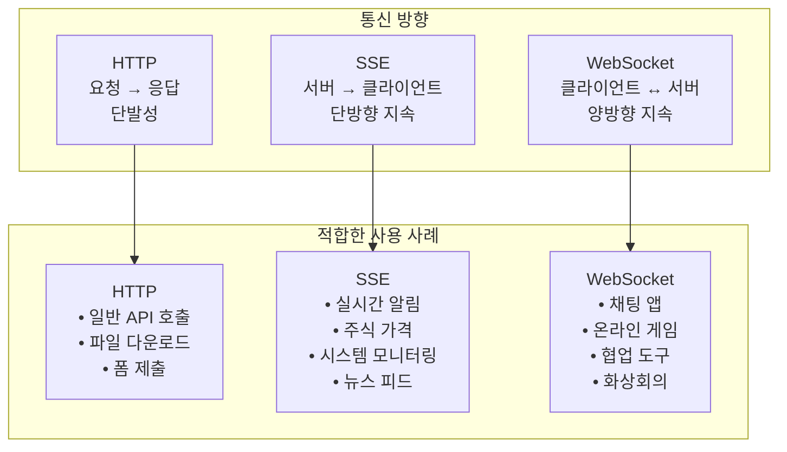

# SSE와 실시간 알림

## 실시간 통신

### 전통적인 HTTP 요청-응답 모델의 한계

- HTTP -> Stateless

**문제 1. 서버에서 클라이언트로의 능동적 통신 불가.**

전통적인 REST API는 클라이언트의 요청이 필요하다. 서버에서 알림을 할 일이 생겨도, 클라이언트가 체크하기 전까지는 전달할 수 없다.

**문제 2. 실시간성의 부재**

서버에서 데이터의 상태가 변경이 되어도 클라이언트가 보고 있는 화면에는 사용자가 새로고침을 하기 전까지 이전 데이터 정보를 보게된다.

**문제 3. 불필요한 네트워크 트래픽과 서버 부하**

클라이언트가 변경된 데이터의 최신 정보를 얻기 위해 주기적으로 서버에 데이터를 요청 또는, 커넥션을 계속 가지고 있는 경우에 서버 리소스가 낭비되고, 네트워크 대역폭이 낭비된다.

### 웹 애플리케이션의 실시간성 요구 증가

**소셜미디어와 커뮤니케이션**

- 실시간 채팅 -> 즉시 상대박에게 도달
- 라이브 피드 -> 새 게시물이나 댓글의 즉시 업데이트
- 온라인 상태 -> 상대방의 접속 상태 실시간 표시

**협업 도구**

- 동시 편집 -> Google Docs
- 실시간 커서 -> 다른 사용자의 커서 위치 표시
- 즉시 동기화 -> 한 명이 수정하면 모든 참여자에게 즉시 반영

**게임과 엔터테인먼트**

- 멀티플레이어 게임 -> 다른 플레이어의 움직임 실시간 동기화
  등등..

## 실시간 통신 패러다임

### 폴링(Polling)

- 가장 단순한 구현
  서버 측 - 새 메시지를 확인하는 API ('/api/messages/check')

```javascript
// 클라이언트 측 - 5초마다 폴링
function pollForNewMessages() {
  fetch(`/api/messages/check?lastMessageId=${lastMessageId}&userId=${userId}`).then(); //... 처리
}

// 5초마다 실행
setInterval(pollForNewMessages, 5000);
```

**문제점**

- 리소스 낭비
  - API 서버에 5초마다 새 메시지를 받기까지 불필요한 요청이 발생한다.
- 실시간성 부족
  - 폴링의 시간 간격 동안 메시지의 실시간성을 잃는다
- 서버 부하 증가
  - 1000 명의 동접자가 5초마다 폴링 -> 초당 200개의 요청이 계속 발생 -> 대부분이 no new message 응답

### 롱 폴링(Long Polling)

- 폴링의 비효율성을 개선하기 위해 탄생
- 클라이언트가 요청을 보내면, 서버가 새로운 데이터가 생길 때까지 연결을 유지하고 대기한다.

**개선점과 한계**

- 개선점
  - 불필요한 요청 크게 감소
  - 더 빠른 실시간 응답
  - 기존 HTTP 인프라 활용 가능
- 한계
  - 서버 리소스 점유 : 1000명 접속 시 1000개의 대기 상태 유지
  - 프록시/로드밸런서 타임 아웃 문제
    - 대부분 프록시는 60초 내외에서 연결을 끊는 설정
  - 에러 처리 복잡성
    - 네트워크 끊김, 서버 재시작 등의 상황 처리가 복잡

## 양방향/단방향 통신

단방향 통신 (Server -> Client) : 서버에서 클라이언트로만 데이터를 보내는 경우

양방향 통신 (Client <-> Server) : 클라이언트와 서버가 모두 데이터를 주고 받는 경우

### 통신 패턴 선택 기준

단방향 통신 선택

- 클라이언트가 데이터를 받기만 하는 경우
- 구현이 단순
- 서버 리소스 사용량이 상대적으로 적은 경우
- 주식 가격, 뉴스 피드, 시스템 모니터링

양방향 통신 선택

- 클라이언트와 서버가 모두 데이터를 주고 받아야하는 경우
- 실시간 상호작용이 필요한 경우
- 더 복잡하지만 풍부한 기능 제공
- 채팅, 게임, 협업 도구, 화상 회의

### WebSocket

HTTP 연결을 통해 시작되지만, 일단 연결이 성립되면 TCP 기반 전이중(양방향) 통신을 제공한다.

### SSE

Server-Sent Event, 서버에서 클라이언트로 단방향 실시간 데이터 스트리밍을 제공한다.

| 기술      | 방향성 | 프로토콜      | 연결 유지 | 브라우저 지원 | 구현 복잡도 |
| --------- | ------ | ------------- | --------- | ------------- | ----------- |
| 폴링      | 단방향 | HTTP          | X         | 전체          | 낮음        |
| 롱폴링    | 단방향 | HTTP          | Partial   | 전체          | 중간        |
| SSE       | 단방향 | HTTP          | O         | IE 미지원     | 낮음        |
| WebSocket | 양방향 | TCP/WebSocket | O         | 전체          | 중간        |


전통적인 HTTP요청-응답 모델로 실시간 채팅을 구현한다면, 어떤 문제점들이 발생하나요?
1. 서버에서 클라이언트로의 능동적 통신 불가
2. 폴링 방식의 비 효율성
3. 실시간성 부족

롱폴링과 일반 폴링의 차이점은 무엇이며, 롱폴링에도 어떤 한계가 있는지 설명해주세요
- 롱폴링을 사용하면 불필요한 요청이 크게 감소합니다. 그리고 더 빠른 실시간 응답이 가능합니다.
- 롱폴링의 한계는 서버 리소스 점유와 프록시/로드밸런서 타임아웃 문제 그리고 복잡한 에러 처리 등이 있습니다.

## Server-Sent Events
